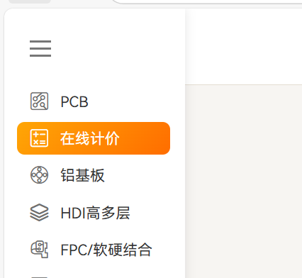
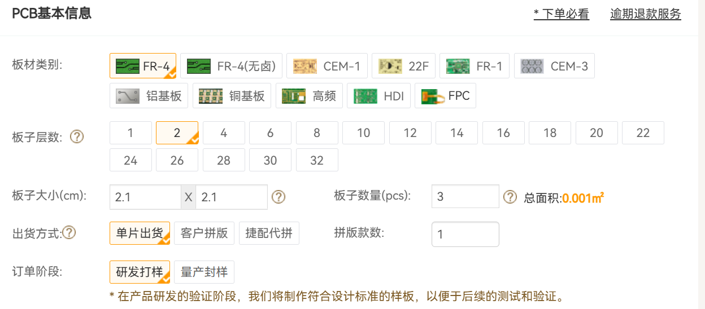
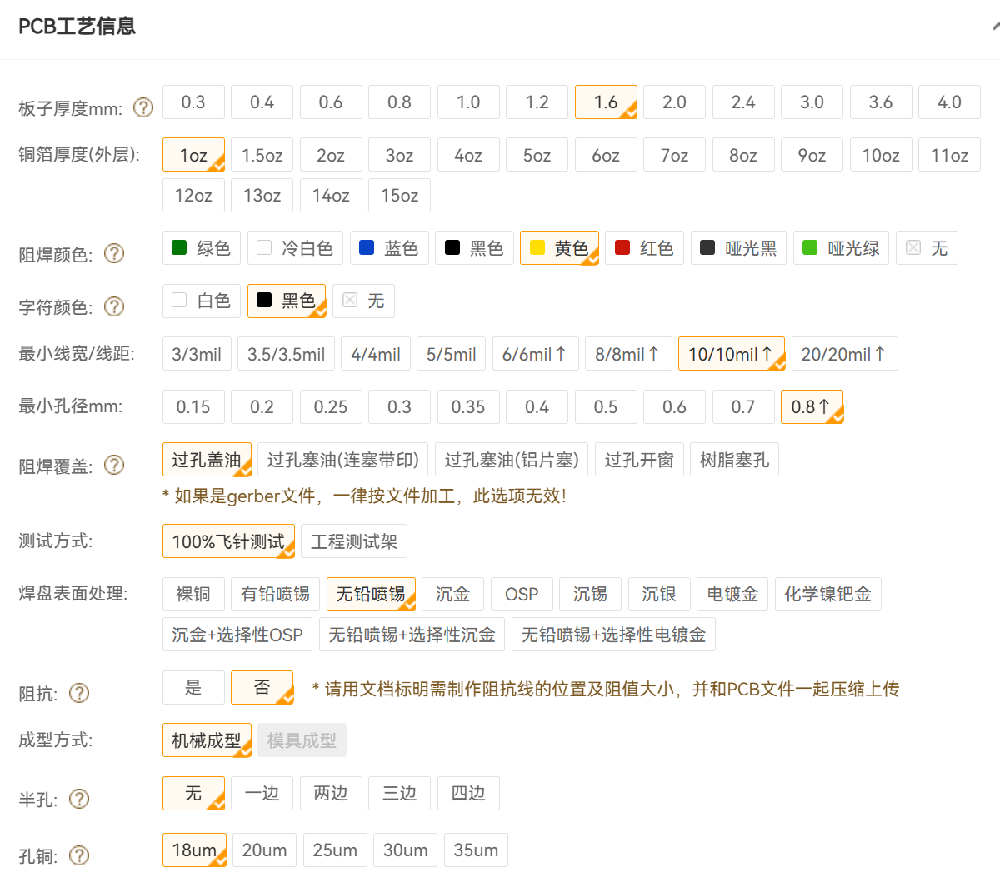
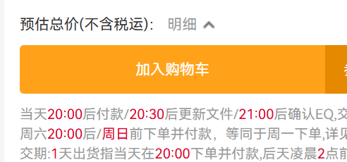
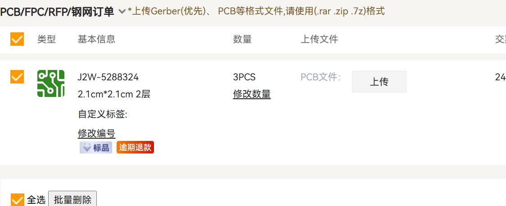
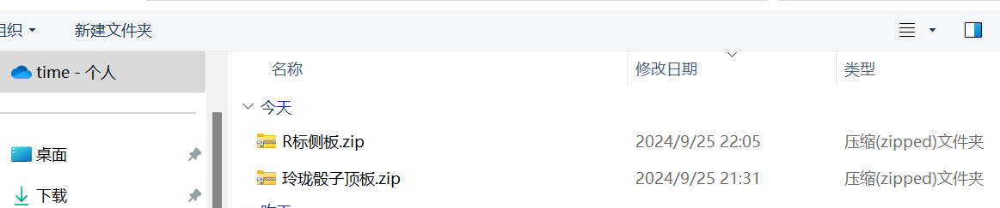
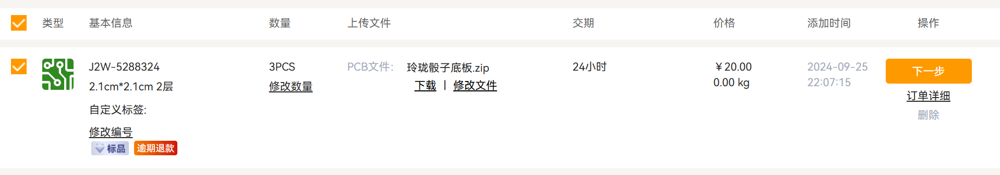

# 使用捷配下单PCB

## 1 捷配下单

### 1.1 捷配下单官网

[PCB打样_线路板打样_捷配极速PCB超级工厂 (jiepei.com)](https://www.jiepei.com/)

### 1.2 下单前记得领取优惠卷

 

满屏幕都是立即免费打样，随便点进去都能领取优惠卷

 ## 2 下单流程

### 2.1 在线计价

#### 2.1.1 点击左侧的在线计价

#### 2.1.2 PCB的基本信息

1. 板材类别：玲珑骰子项目选择FR-4（大部分情况是选择FR-4，不过少部分情况根据自己的需求换板材）
2. 板子层数：玲珑骰子项目侧板和底板选择2，顶板选择4
3. 板子大小：玲珑骰子项目选择2.1 x 2.1
4. 板子数量：板子层数选择2的时候，板子数量选择3；板子层数选择4的时候选择5；
5. 出货方式：单片出货
6. 订单阶段：研发打样

​	如下图

#### 2.1.3 PCB工艺信息

​	玲珑骰子项目中需要更改的只有

1. 阻焊颜色：金矿石选择黄色，银矿石选择冷白色
2. 字符颜色：选择黑色
3. 焊盘表面处理：金矿石选择无铅喷锡，银矿石选择无铅喷锡（后续板子需要改进）

#### 2.1.4 加入购物车

* 点击`加入购物车`

* 点击`去购物车结算`

v

### 2.2 上传gerber文件，下单

* 点击PCB文件这边的`上传`

* 然后点击导出来的gerber文件（.zip后缀）

* 然后点击`下一步`

* 然后选择后地址、联系人等信息就可以下单了

