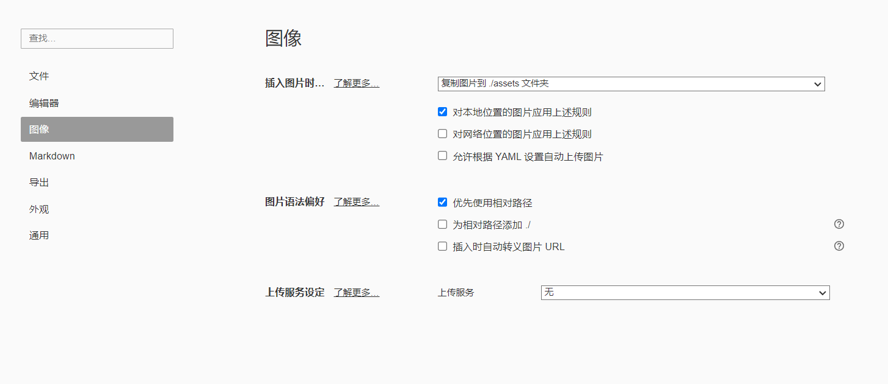
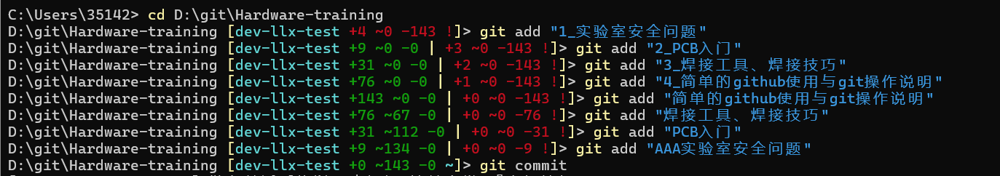
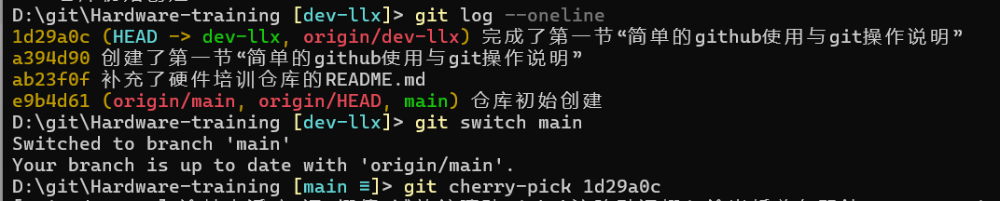
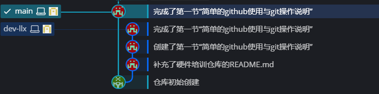
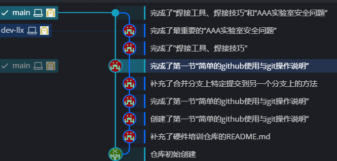
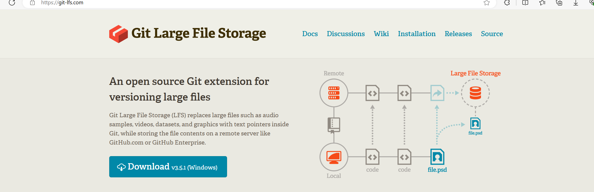

# 简单的github使用与git操作说明

## 1 github简单操作

### 1.1 github拉取仓库（不需要git版本）

[Helios-hardware repositories (github.com) 硬件培训地址](https://github.com/orgs/Helios-hardware/repositories)


点开我们的`Helios-hardware`团队，然后可以看到`Helios-hardware-training`，点进去，下面的`README`是对这个仓库的说明，可以先看完这个`README`，对整个仓库有个基础的认识。


如果不会`git`的话，直接点击`Code`，然后选择`Download ZIP`，就可以把这个仓库下载到本地了

### 1.2 Issues功能和Discussions功能

#### 1.2.1 issues（问题）

GitHub 的 Issues 功能用于跟踪项目中的任务、缺陷、增强功能请求等。可以在这个界面上进行讨论，添加评论以跟踪进展或提供更多信息。

==但是不要在这个界面注水，这个界面发起的讨论，关注这个仓库的人都能接收到消息，团队成员可能会被无关的讨论和通知分散注意力，影响有效沟通和协作==

#### 1.2.2 Discussions功能

GitHub 的 Discussions 功能用于促进团队和社区成员之间的开放讨论。要注水在这里面。

### 1.3 github上查看分支图

点击`Insights`


选择旁边的`Network`就可以看到提交的分支图了


但个人感觉，github上的分支图显示不够明确，具体优化见3.14 git的图形化界面

## 2 Typora和md格式

### 2.1 Typora

#### 2.1.1 下载typora

* 下载typora

#### 2.1.2 配置偏好

* 打开大纲


* 偏好设置

点击`偏好设置`


选择`复制图片到./assets文件夹`（这样可以把截图得到的图片，存储到同名文件下的assets文件里面）

再勾选下面那个`优先使用相对路径`，这样你插入的图片就是相对路径而不是绝对路径了



* md语法设置


Markdown里面的 `Markdown拓展语法` 全部选上

### 2.2 md格式

暂时不写了，好用，自己找教程

## 3 git操作说明

### 3.1 下载git

* 下载git

### 3.2 打开终端

* 打开终端

### 3.3 git初始化配置

* 查看git安装是否安装成功

```
git -v
```

* 设置所有仓库的用户名

```
将kid-king-x改成你自己的用户名
git config --global user.name kid-king-x
```

==如果用户名中间有空格，需要加上双引号==

* 设置邮箱

```
将3514205831@qq.com改成你自己的邮箱
git config --global user.email 3514205831@qq.com
```

* 保存上面两个的信息，节省每次都敲

```
git config --global credential.helper store
```

* 寻找刚刚配置的用户名和邮箱

```
git config --global --list
```

### 3.4 安装posh-git模块

#### 步骤 1：安装 PowerShell 模块

* **打开 PowerShell**：

* **安装posh-git**：

​	在Powershell中执行下面的命令

```powershell
Install-Module posh-git -Scope CurrentUser
```


#### 步骤 2：配置 PowerShell

* **编辑 PowerShell 配置文件**：

​	输入以下命令来打开你的 PowerShell 配置文件（如果不存在，它会被创建）：

```
notepad $PROFILE
```

* **添加posh-git模块**：

  在打开的配置文件里面添加下面语句

  ```
  Import-Module posh-git
  ```

  保存并关闭配置文件。


* **重新启动PowerShell**

#### 3 可能会出现的问题

* PowerShell 执行策略限制了脚本的执行，默认情况下，PowerShell 的执行策略可能设置为 `Restricted`，这会阻止所有脚本的运行


* 管理员模式打开windows Powershell


* 检测当前执行策略

  ```
  Get-ExecutionPolicy
  ```

  这将显示当前的执行策略。例如，它可能显示为 `Restricted`。

* 更改执行策略

  ```
  Set-ExecutionPolicy RemoteSigned
  Set-ExecutionPolicy Unrestricted
  ```

  `RemoteSigned` 允许本地创建的脚本运行，但要求从互联网下载的脚本有有效的签名。如果你希望更宽松的设置，可以使用 `Unrestricted`

* **验证执行策略已更改**：

  ```
  Get-ExecutionPolicy
  ```

  确保它显示为你刚刚设置的值（例如 `RemoteSigned` 或 `Unrestricted`）。

#### 4 确保脚本可以运行

* **确认 Git 配置**

  ```
  git config --global user.name
  git config --global user.email
  ```

* **确认 PowerShell 配置文件**

1. 打开 PowerShell 配置文件：

​	Import-Module posh-git应该有这么一行

2. 保存并关闭文件

3. 重新加载配置文件

   ```
   . $PROFILE
   ```

4. 重启Powershell

* **确认posh-git安装**

  ```
  Get-Module -ListAvailable -Name posh-git
  ```

* **检测提示符**

  ```
  git branch
  ```

  这会显示当前分支，并帮助确认 Git 是否正常工作。

### 3.5 SSH配置和克隆仓库以及创建仓库

1. HTTPS开头的方式，在把本地代码push到远程仓库的时候，需要验证用户名和密码

2. SSH方式在推送的时候不需要验证用户名和密码，但是需要在github上添加SSH公钥的配置（推荐）

#### 3.5.1 SSH配置

##### 3.5.1.1 生成SSH密钥对

* 在powershell中生成SSH密钥对

```
ssh-keygen -t rsa -b 4096 -C "your_email@example.com"
```

##### 3.5.1.2 配置SSH客户端

如果是第一次配置SSH客户端，`Enter`按到底就行，如果不是，还需要配置`config`文件（自行搜索）

* 查看生成的密钥

```
ls ~/.ssh
```


可以看到刚刚的操作生成了两个文件，上面那个`id_rsa`是私钥文件，谁也不要给，下面那个`id_rsa.pub`公钥文件，上传到github

* 打开公钥文件

```
Get-Content ~/.ssh/id_rsa.pub
```


点击`Settings`


点击`SSH and GPG keys`

然后点击`New SSH key`


将刚刚打开的公钥文件内容复制粘贴，再给个Title

那么密钥的配置就完成了

#### 3.5.2 克隆远程仓库


复制上面的地址，然后打开终端，进行git clone的操作


`Enter passphrase for key '/c/Users/35142/.ssh/id_rsa':`这行是输入你刚刚创建密钥的密码

这样就克隆远程仓库到你本地的仓库了

#### 3.5.3 推送和拉取文件到远程仓库


##### 3.5.3.1 推送文件到远程仓库


##### 3.5.3.2 拉取文件到本地仓库

* 在本地仓库执行`git pull`

```
git pull
```

这个命令会从默认的远程仓库（通常是 `origin`）拉取当前分支的最新更改，并自动将这些更改合并到本地分支。

* 指定远程仓库和分支

```
git pull <remote> <branch>
```

1. `<remote>` 是远程仓库的名称（通常是 `origin`）。

2. `<branch>` 是远程分支的名称（如 `main` 或 `develop`）。


如果远程仓库中的修改内容和本地仓库的修改内容没有冲突的话，git自动为我们执行的一次合并操作可以成功

* 获取远程仓库的修改（不会自动合并到本地仓库）

```
git fetch
```

#### 3.5.4 创建仓库

```
//方式一：本地
git init
//方式二：远程服务器
git clone
```

```
mkdir git-test  //创建目录
cd git-test  //切换目录
```

* 创建本地仓库


查看当前目录下所有的文件（包括隐藏文件）

```
Get-ChildItem -Force
```


* 拉远程仓库（这里采用的是和上面ssh不同的https的方式，不需要配置ssh）


### 3.6 工作区域、文件状态、添加提交文件、回退版本

* git的本地数据管理分为三个区域


可以将修改的文件先添加到暂存区中，然后再把所有暂存区中的文件统一执行一下提交操作

* 文件的四种状态


* 查看仓库的状态

```
git status
```


给仓库添加了一个文件后


目前这个文件就是处在一个未被跟踪的状态

* 将文件添加到暂存区

```
git add
```


如果是中文文件夹，会出现乱码，如下面这样加入暂存区

```
 直接"文件夹名字"
 git add "简单的github使用与git操作说明"
```


* 将文件提交到本地仓库

```
git commit
```

这个命令只会提交暂存区的文件，不会提交工作区的文件

* 查看提交历史

```
git log
```


* git reset的三种模式

```
git reset--soft
git reset--hard
git reset--mixed
```

soft表示回退到一个版本，并且保存工作区和暂存区的内容

hard表示回退到一个版本，并且丢弃工作区和暂存区的内容

mixed表示回退到一个版本，并且保留工作区但是丢弃暂存区的内容


* 如果要修改文件夹的名称的话，git add "现在这个文件夹的名称"，再git add "原本那个文件夹的名称"



### 3.7 查看文件差异

```
git diff
```

当我修改了re.txt文件里面的内容


重新提交暂存区和本地仓库


用git比较当前版本和上一个版本之间的差异

```
git diff HEAD~ HEAD
```

git diff还有其他的对比差异，可以自己查询，不一一列举

### 3.8 删除文件

```
rm
```


然后再使用git add来删除暂存区的文件


```
git rm
```


最后要记得提交，否则删除的文件在版本库中还会存在


### 3.9 .gitignore忽略文件

应该忽略的文件：

1. 系统或者软件自动生成的文件
2. 编译产生的中间文件和结果文件
3. 运行时生成的日志文件、缓存文件、临时文件
4. 涉及身份、密码、口令、密钥等敏感信息文件

* 创建 `.gitignore` 文件

```
// 在powershell中创建
New-Item -Path .gitignore -ItemType File

//在cmd中创建
echo. > .gitignore
```

* 编辑`.gitignore`文件

```
# 忽略所有的 .log 文件
*.log

# 忽略 node_modules 目录
node_modules/

# 忽略所有 .tmp 文件，但不忽略 tmp/important.tmp
*.tmp
!tmp/important.tmp
```

* 提交`.gitignore`文件

```
git add .gitignore
git commit -m "Add .gitignore file"
```

当我创建了re.log文件后


`.gitignore`文件生效有个前提，就是这个文件不能被添加到版本库里面

* 只删除版本库里面的文件，不删除本地文件

```
git rm --cached re.log//例子
```

空的文件夹底下如果没有文件的话，是不会被纳入到版本控制里面的，但如果有文件的话，就会被纳入版本控制中

### 3.10 分支

#### 3.10.1 分支基础操作

* 创建新的分支|查看分支

```
git branch
```


* 切换到不同分支

```
git switch
```


* 合并分支到主线分支

```
git merge
```

merge后面的分支就是将要合并的分支，git前面的分支就是合并后的目标分支


上面那张图片显示的就是把dev分支合并到main分支

但是注意，这样的merge会把dev分支上所有的提交历史都合并到main分支上面（会显得杂乱无章，所以推荐下面这个）

* 只合并特定的提交到主分支（用最多的）

先查看需要合并的分支的哈希值，可以使用下面的命令行来找到提交历史

```
git log --oneline
```

然后再切换到你需要合并的分支，比如我想要把dev-llx分支的最后一次提交合并到main分支上

```
git switch main
```

```
git cherry-pick <需要合并的提交的哈希值>
```



那么分支图就会像下面这样（使用GitKraken生成的分支图，主分支只留下完成的最终版本）



* 显示分支图

```
git log --graph --oneline --decorate --all
```

* 删除分支 

```
git branch -d
```


* 在删除分支后，把删除的信息推送到远程仓库

```
git push origin --delete branch-name
```

#### 3.10.2解决合并冲突

1. **执行合并操作**： 当你尝试合并两个分支时，比如`main`分支和`feature`分支，使用以下命令：

```
git checkout main
git pull origin main
git merge feature
```

2. **遇到冲突时**： 如果有冲突，Git 会告诉你哪些文件有冲突，并在这些文件中标记冲突区域。

3. **查看冲突文件**： 使用以下命令查看哪些文件有冲突：

```
git status
```

冲突的文件会显示为“unmerged paths”。

4. **打开冲突文件**： 打开有冲突的文件，你会看到类似下面的标记：

```
plaintext复制代码<<<<<<< HEAD
// 当前分支的内容
=======
// 合并分支的内容
>>>>>>> feature
```

这些标记帮助你确定哪些部分来自当前分支（HEAD），哪些部分来自合并分支（feature）。

5. **解决冲突**： 编辑文件，手动解决冲突，移除冲突标记。决定保留哪些更改，或将它们合并到一个新版本中。

6. **标记冲突已解决**： 一旦你解决了冲突并保存了文件，使用以下命令将它们标记为已解决：

```
git add <file>
```

对每一个冲突文件执行`git add`。

7. **完成合并**： 完成所有冲突解决并标记为已解决后，提交合并：

```
git commit
```

Git 会自动生成一个合并提交的消息，你可以修改它或直接保存。

8. **推送更改**： 如果你在远程分支上进行了合并，推送更改到远程仓库：

```
git push origin main
```

<<<<<<< HEAD
=======
#### 3.10.3 分支操作（看起来清晰一点）



类似于这种图，一般来说，在dev-llx分支上，我一般放的是一版版迭代（还会有一支dev-llx-test修改小bug用），然后只把dev-llx里面的版本基本完善好的放入main分支里面（cherry-pick）。也有每个提交都挺重要的，就直接merge上去了

>>>>>>> dev-llx
### 3.11 回退和rebase

* 回退

```
git checkout -b <分支><提交ID>
```

* 查看提交id

```
git log --oneline
git log --oneline -n 10//查看最近10条的提交id
git log --graph --oneline --decorate --all//直接查看分支图
```


#### 3.11.1 rebase操作

1. **切换到你要rebase的分支**：

```
git checkout feature-branch
```

2. **执行rebase**： 将`feature-branch`的提交移到`main`分支的最新提交上：

```
git rebase main
```

3. **解决冲突**： 如果遇到冲突，Git 会暂停rebase过程。解决冲突后，使用：

```
git add <resolved-file>
git rebase --continue
```

4. **中止rebase**（如有必要）： 如果你决定不再继续rebase，可以中止过程：

```
git rebase --abort
```

5. **推送更改**： 如果你rebase了远程分支，需要强制推送：

```
git push origin feature-branch --force
```

### 3.12 GitHub Flow

GitHub Flow 是一种简化的分支工作流，用于协作开发，特别适合持续部署。基本步骤包括：

1. **主分支**： 所有稳定代码都在 `main` 分支上。

2. **创建功能分支**： 从 `main` 分支创建一个新的功能分支：

```
git checkout -b feature-branch
```

3. **进行开发和提交**： 在功能分支上进行更改并提交：

```
git add .
git commit -m "Add new feature"
```

4. **推送到远程**： 将功能分支推送到远程仓库：

```
git push origin feature-branch
```

5. **创建Pull Request**： 在GitHub上创建一个Pull Request（PR），请求将功能分支合并到`main`分支。

6. **代码审查和合并**： 进行代码审查，确保一切正常后，将PR合并到`main`分支。

7. **部署**： 合并到`main`分支后，通常会自动触发部署。

### 3.13 git的GUI图形化界面

#### 3.13.1 GitHubDesktop

这个是github推出的`GitHubDesktop`，对比于`GitKraken`，免费无限制

官网下载地址   [Download GitHub Desktop | GitHub Desktop](https://desktop.github.com/download/)


导入仓库


个人感觉`Diff display`里面选择`Split`比较好用

左侧的`History`可以看到每次commit的信息


但有不足就是，看不到分支图

#### 3.13.2 GitKraken 


选择`Open Repo`，


就剋看到分支图了


### 3.14 在github上传超过100MB大小的文件

Github有一个限制，不能上传超过100MB大小的文件。解决方法如下：

* 首先，需要安装Git LFS，可以从Git LFS官方网站下载，[https://git-lfs.com/](https://git-lfs.com/)



* 然后进入powershell，输入安装命令

```
git lfs install
```

* 然后进入需要管理的仓库

```
git lfs track "file"
```

其中file是需要上传的大文件。

* 执行完命令后会发现目录下生成了一个"**.gitattributes**"文件，文件内记录了我们要上传文件的信息。只有先把".gitattributes"传上去，才可以上传大文件。

```
git add .gitattributes
git commit -m "submit file"
git push origin main 
```

* 上传完毕后，开始上传大文件。

