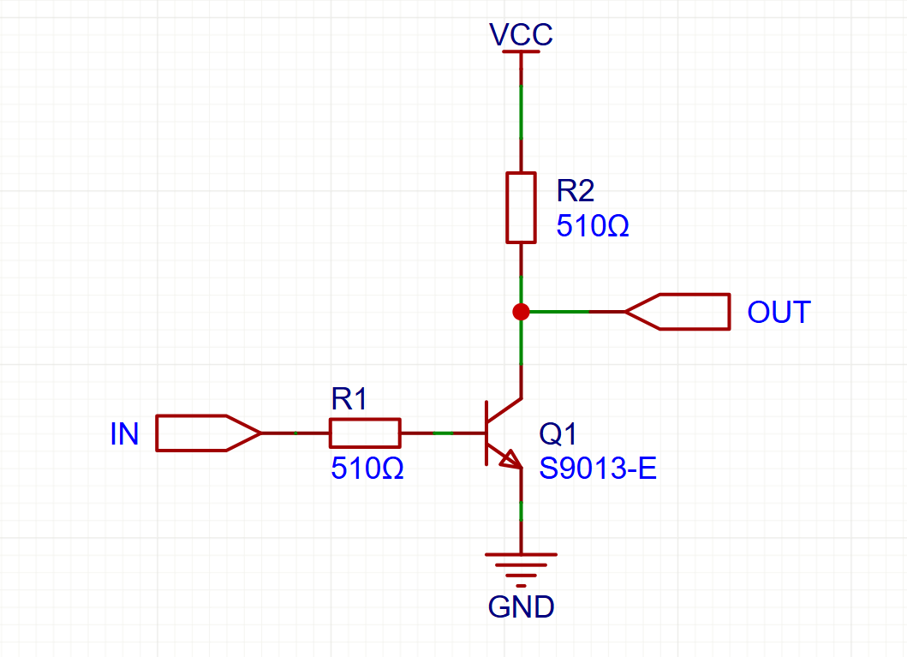
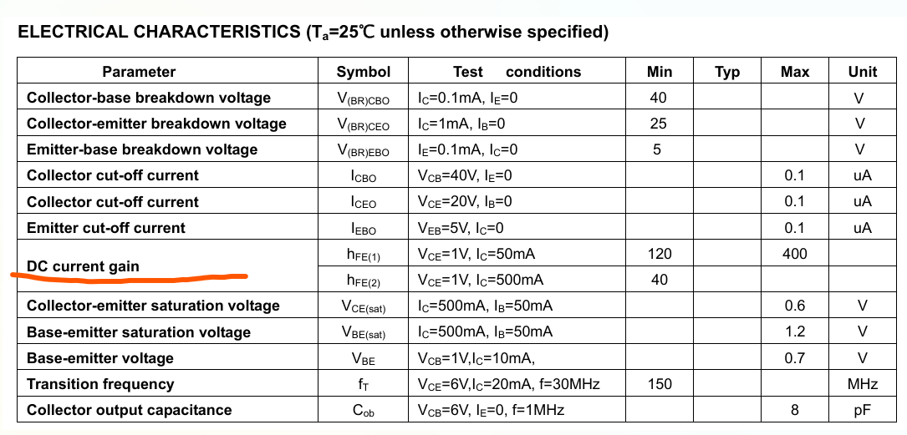
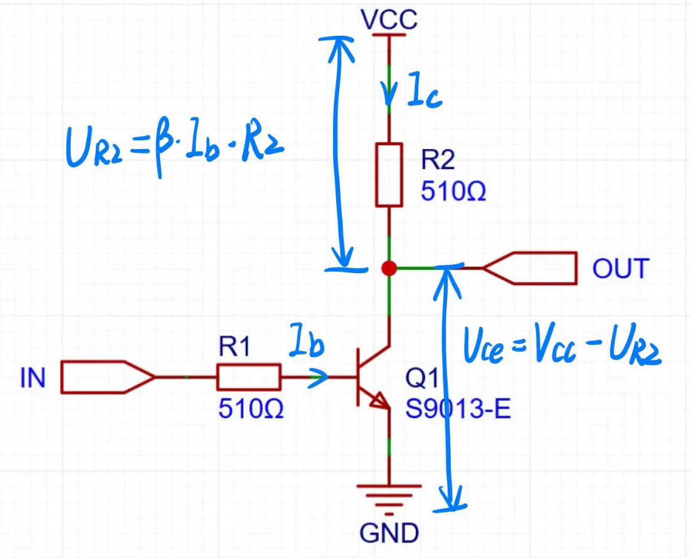
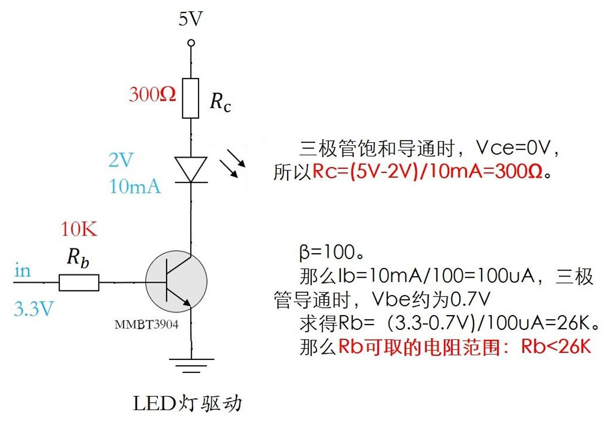
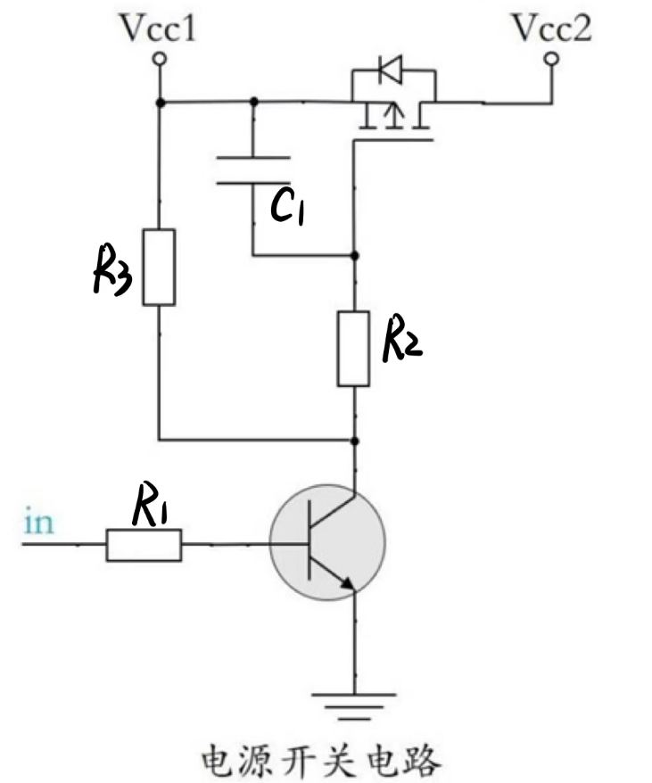

# 三极管

* 三极管的核心是**小电流控制大电流**

* 入门学习视频：
  1. [三极管是如何导电？超形象动画让你一看就懂！_哔哩哔哩_bilibili](https://www.bilibili.com/video/BV1kv411574Y/?spm_id_from=333.337.search-card.all.click&vd_source=5fc6351cf113dfef6abb9b02ed12c9b7)
  2. [三极管的饱和与放大_哔哩哔哩_bilibili](https://www.bilibili.com/video/BV1Jq4y1E7QZ/?spm_id_from=333.337.search-card.all.click&vd_source=5fc6351cf113dfef6abb9b02ed12c9b7)
  3. [三极管应用，控制一个LED灯的开关_哔哩哔哩_bilibili](https://www.bilibili.com/video/BV1ah411J7Yd/?vd_source=5fc6351cf113dfef6abb9b02ed12c9b7)

## 一. 三极管常用电路

一般来说，我们是把三极管单作一个开关来使用（对比于机械开关，三极管可以通过信号来控制），所以三极管要么工作在饱和区（导通），要么工作在截至区（不导通），一般不会让他工作在放大区。

### 1. 电平反转

这个电路的逻辑就是，如果我的输入信号为1，那么OUT输出信号为0，如果输入信号为0，输出信号为1（这里的10代表的是高低电平）

那么对于这个电路，怎么去计算R1与R2 的阻值呢（图上那个是随便挑的阻值）。打开S9013的数据手册可以看到

可以看到这个**DC current gain**，这个就是放大倍数β，在三极管工作在放大区的时候，I~c~ =β *  I~b~。

先假定三极管工作在放大状态，那么放大倍数就是β， 如果基极有I~b~电流流过，那么集电极I~c~=β*I~b~，I~c~也会在R2上面产生压降。

可以得到VCC = U~R2~ + U~ce~，并且随着I~b~的增加，U~R2~不断增加，等到U~R2~ = VCC的时候，就是I~c~不能再随着β这个放大倍数继续上升的时候，那么此时三极管到达饱和区。

假设此时我的I~c~ = 500mA，那么，可以根据图上看出，放大倍数β为40，可以得到I~b~ = 500/40mA，不过可以往数据手册上看，数据手册上说的是I~c~ = 500mA时候，I~b~ = 50mA，然后V~BE~ = 1.2V，那么就可以根据V~IN~ - V~BE~ = I~b~ * R1得到R1的电阻值了，然后只要保证你取得的电阻值会小于你计算出来的这个R1，就可以保证你的三极管工作在饱和区了。

一般来说，不会顶着这个电阻值用，会给他取得小一些，这样I~b~更大，更能让三极管工作在饱和状态。

算出来所有电阻值后，你还可以反向验证一下你计算出来的值。

### 2. 驱动LED灯

### 3. 驱动MOS开关

* 在in为低时，三极管不导通，相当于是开路，PMOS管的Vgs为0，PMOS管也不导通，Vcc2没有 电。

* 在in为高时，三极管导通，集电极相当于是接地GND，于是PMOS管的Vgs为-Vcc1，PMOS管导通，也就是Vcc1与Vcc2之间导通，Vcc2有电。

R2 接到了PMOS管的栅极，我们知道MOS管的栅极阻抗非常大，所以三极管导通稳定之后，R2基 本是没有电流的，所以可以看做是开路，三极管的集电极电流主要从R3流动。

* **那么三极管的Ic电流该如何设定呢？**

​	我们要在in是3.3V的时候，Vce基本为0，Ic倒是没有说必须要多少合适。这个时候我们可以先定一 个，比如定R3=10K，4.7K，20K等等都是可以的。 

​	我们就先定R3=10K吧，为什么定这个，因为这个是常用电阻。不过我们需要知道，如果电阻定太小， 那么Ic的电流必然会比较大，就会浪费电（功耗大，发热）

​	电源为12V，那么Ic=12V/10K=1.2mA。从MMBT手册知道，1mA左右，三极管的放大倍数最小是 80，所以Ib=1.2mA/80=15uA。那么R1=(3.3-0.7）/15uA=173k。也就是说R1需要满足R1<173K就可以 让三极管饱和导通。 

​	因为R3已经选定了10K，那么R1也可以选择10K了（物料归一，少些种类）。 

* **R2，C1有什么用呢？ **

在上电的一瞬间，因为电容两端的电压不能突变，所以C1会将MOS管的Vgs钳制在0V，让MOS 管不会误导通，C1通常可以选择100nF左右。 

* **那么R2有什么用呢？ **

R2 可以限制三极管的Ic电流，因为in的电压突然变化的时候，三极管状态突然改变，Vce电压会突 然改变，需要对电容C1进行充放电，这个电流可以通过R2来限制。 

我们也可以通过R2和C1一起来调节PMOS管的导通时间，其实本质就是RC的充放电。如果没有严 格的时间要求，R2和C1的选择很宽泛，像我一般用100nF和100K。

（部分摘自硬件工程师练成之路，啊因为不想自己慢慢码了，而且第三个电路我一般不多）
