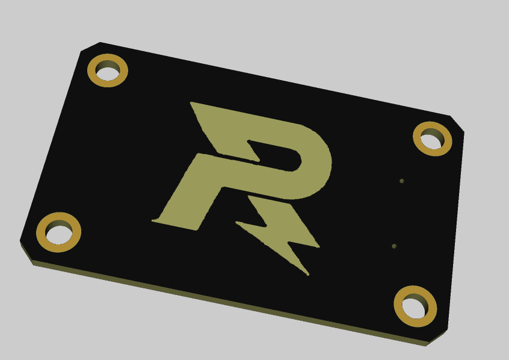
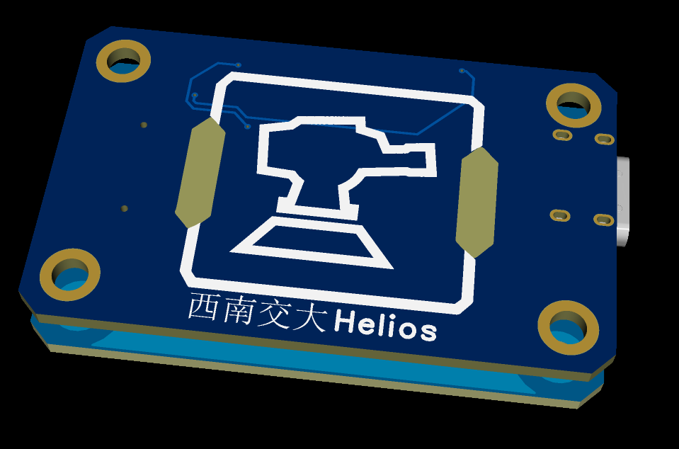
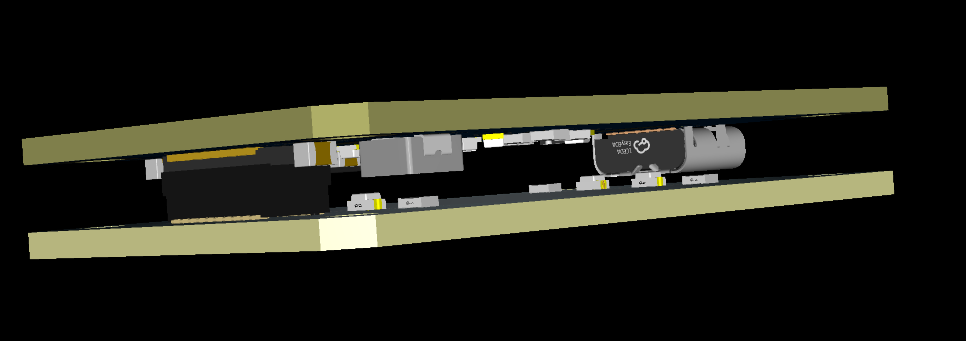
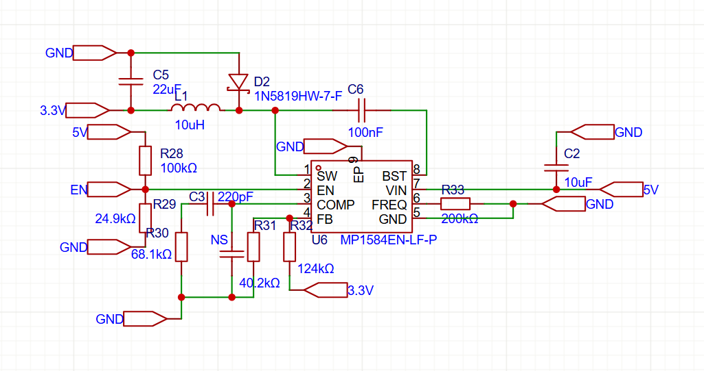
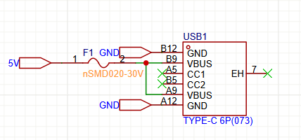
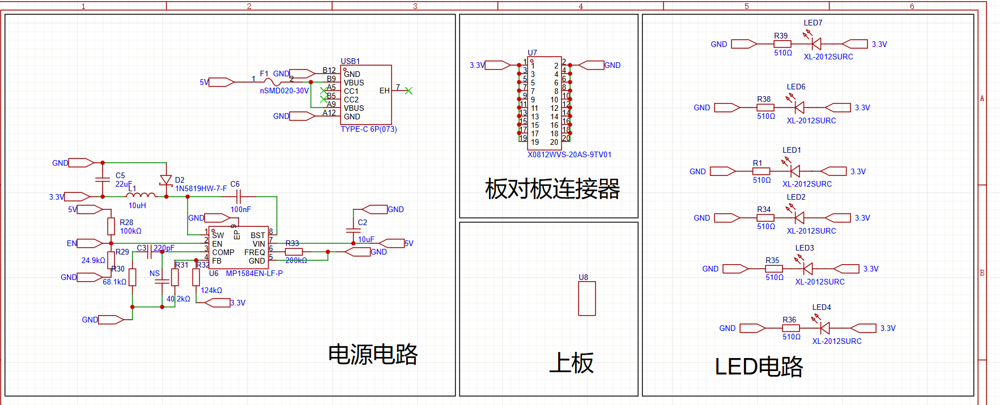
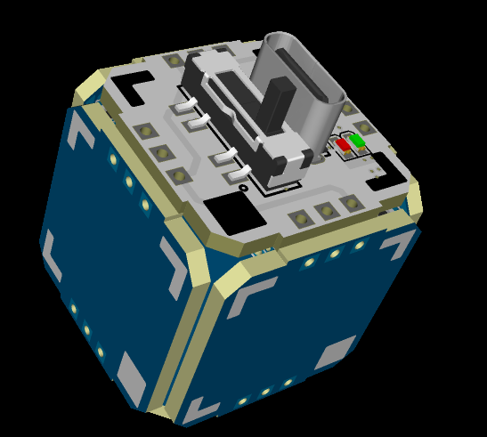

# R标哨兵小周边

* 特地用的好焊接的封装0805，是用作培训的项目，应该也会是兴趣硬件组同学的第一个小项目，硬件组培训时候会手把手带着画，画的同时，带着认识元器件

* R标哨兵小周边上板3D文件.step这个文件，是导出的周边上面那块板子的3D文件

​	R标哨兵小周边上板+下板3D文件.step这个文件，是同时导出两块板子的3D文件，同时可以看出两块板子是怎么连接的

* 电源电路

这个是5V降压3.3V的dcdc电路，使用的是MP1584这颗比较常见便宜的芯片

这个是typec的输入端，考虑到typec的输入应该不至于反接，所以并没有加上防反接电路，只是加了颗保险丝，同时cc引脚被我放上了非连接标识（就是那个绿色的X），代表的是不支持快充

这块板子其实画的不讲究（因为这块难度不高，原理简单），因为其他的板子，都会把每个模块给他圈画好，方便他人看。所以我重新修改了下电路图（不过main分支上的的工程原理图并没有被我修改），如下：（为了初学者方便，所以分的比较细）

* 然后可能有人会比较好奇（可能也没人），就是为什么我可以同时导出上板+下板的3D文件，还能看到两个板子的连接方式，嗯，上课会带着操作一遍（这种画法纯粹个人爱好，以及喜欢精巧密集的PCB导致的），这里就不细写了，因为一步步操作写下来太花时间了（如果是别的学校的朋友，如果对这个画法感兴趣、同时没有看懂我下面说的操作，可以去RM硬件群问我）

​	主要就是（针对这个工程），先画完PCB的上板，然后导出上板的3D文件，再自己绘制封装，然后绘制好的封装关联上板的3D文件（关联的时候记得要修改上板3D文件对封装本身的位置参数），然后再在下板的工程里面插入自己绘制的上板。

​	好吧，感觉听起来有点绕，但如果操作得当，套娃起来，你就可以得到下面这样的PCB，玲珑骰子v1.0版本

