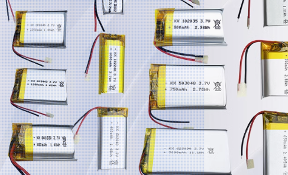
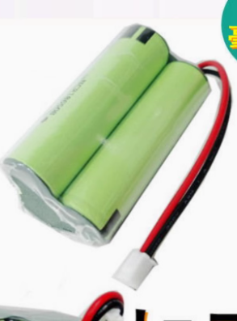
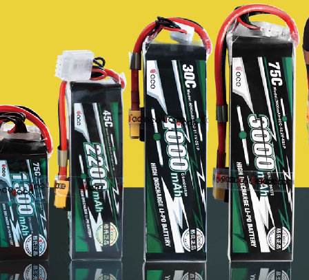
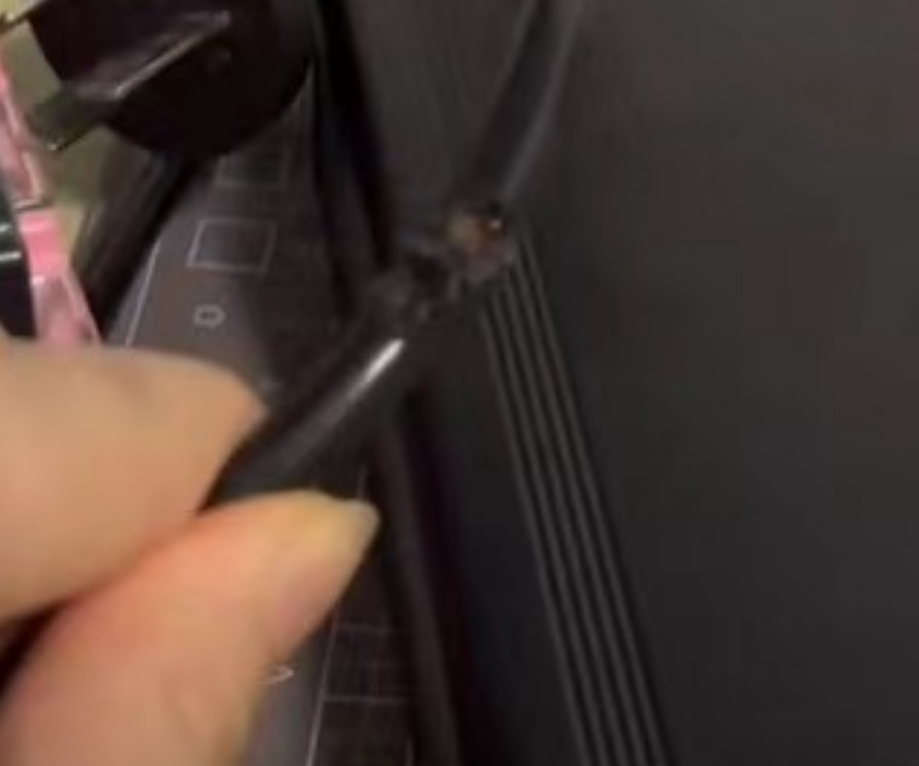
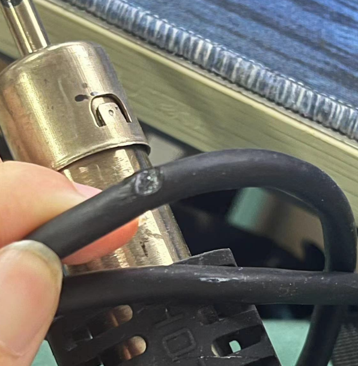

# 实验室安全问题

## 一、锂电池充电问题

### 1.1 锂电池种类

* 锂电池是一种使用锂作为主要成分的电池，它们因高能量密度、长寿命和低自放电率而广泛应用于各种电子设备和电动汽车中。以下是几种常见的锂电池类型：

* 其中航模电池所用的==锂聚合物电池（LiPo）==，相对比与其他的锂电池，提供较高的能量密度，支持高倍率放电，适合需要快速启动和高功率的应用。但是==需要小心使用和存储，因为LiPo电池如果处理不当可能会引发火灾。充电时需使用专用的充电器，存储时需要保持在适当的电量范围，并避免短路或过充。==

### 1.2 锂电池使用规范

* ==不是完全清楚充电设备怎么使用，禁止擅自给锂电池充电==，应该拿锂电池询问学长学姐

* ==充电前看清楚充电设备输出的电压大小==，包括平衡充、官方匹配的充电器
* ==锂电池充电过程，必须有人看着，人走，锂电池停止充电，或者告知实验室其他电控，保证时刻有人看着==
* 避免过充和过放。
  1. **过充**：不要将锂电池充电超过其规定的最大电压（通常为4.2V）。过充可能导致电池过热、膨胀甚至爆炸。
  2. **过放**：不要将电池电量耗尽到0V以下。过放可能导致电池无法再充电或严重缩短其使用寿命，过放的电池应该直接处理好丢掉

* 使用正规充电器

* 避免机械损坏：不要跌落、挤压或撞击锂电池。物理损坏可能导致内部短路，增加爆炸或起火的风险

* 单节锂电池最多充至4.2V，几节就按照这个计算
* 禁止在实验室充电瓶车

### ==若因错误充电造成实验室损失，其损失全部由责任人承担==

### ==锂电池爆燃事故90%由充电器错误设置引发，请认真学习充电器使用方法，否则不要充电==

### 1.3 锂电池起火处理

* 干粉灭火器（非必要不对着车、电子设备喷，带电设备需断电）
* 沙子
* ==锂电池燃尽之前无法被真正扑灭，应在保证自身安全的前提下移开周围有价值的物品==

## 二、烙铁头、加热台

用完的烙铁头注意摆放位置，不要烫到电线

加热台上不放电线、物品

## 三、上电

* 给机器人重新焊接完走线，上电前，先拿万用表测正负极、输出电压。

* 放电池时候，注意正负极

* 检测输出正负极、电压大小没问题后，断电，然后先接线，再上电，以免出现火花
