# PCB入门

## 1 初步认识电路元件

### 1.1 电阻

* 在嘉立创eda里面，常用电阻的封装长这样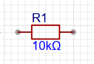（但在不同eda里面，长得可能略有不一样，后面元件同理)

* 常用参数：
  1. 阻值：电阻本身阻值大小（比如10kΩ）
  2. 误差：也就是精度（比如100Ω的电阻，1%的精度，那么这颗电阻的阻值就在99Ω~101Ω之间）
  3. 功率：也就是加在这颗电阻两端的电压、电流乘积不得大于某个特定值（比如0.5w，如果加在电阻上的功率过大，电阻也是会炸的）
  4. 封装：常用的有0603、0805等（这两个都是贴片的，个人比较喜欢精细密集的设计）

### 1.2 电容

* 在嘉立创eda里面，常用电容长这样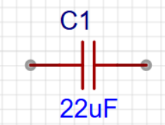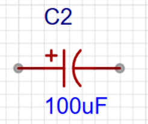第一种是没有极性的，第二种是带极性的

* 常用参数：

  1. 容量：比如上图的22uF
  2. 额定电压：电容两端能够承受的电压大小（如果在电容两端加上了超过他承受限制的电压大小，电容是会炸开的）
  3. 封装：直插的为直径和高度，贴片的为0603、1206等等（并不完全准确这个）

* 电容使用需要注意的：
  1. 注意极性
  2. 电容在相同规格条件下额定电压高可代用额定电压低，低误差可代用高误差，漏电流小可代用漏电流大的
  3. 由于电容存储电量，在断电或通电分析量测参数时务必注意不可短接电容两极

### 1.3 电感

* 在嘉立创eda里面，电感长这样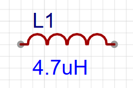

* 主要作用通直流隔交流

* 常用参数：
  1. 感值：比如上图的4.7uH
  2. 额定电流：电感能过的最大电流，电感本身是带电阻的，超过这个最大电流，发热严重，感值下降
  3. 封装：主要是体积，不同电感不同封装

### 1.4 二极管

* 在嘉立创eda里面，二极管长这样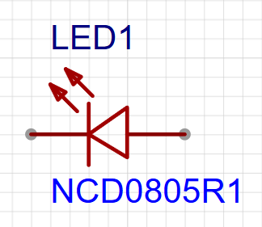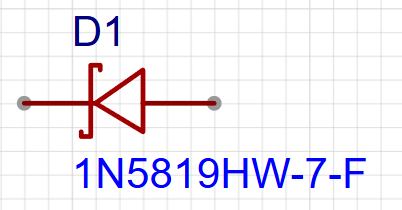

* 二极管有正负极性之分
* 二极管有两个工作状态：处于正偏时导通，两端电压为0.6-0.8V，反偏时截至
* 一般二极管的作用是整流、检波、保护等

### 1.5 三极管

* 在嘉立创eda里面，三极管长这样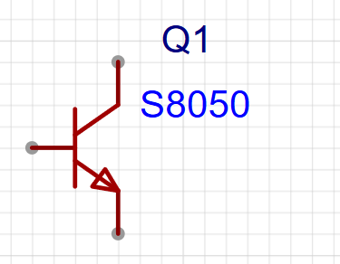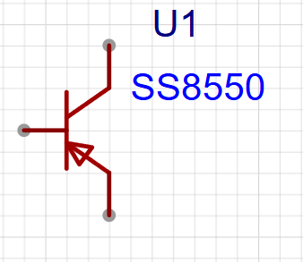左边是NPN，右边是PNP

### 1.6 集成电路（简称IC）

* MCU（单片机）算一种特殊的IC
* 封装方式：常见的有qfp、qfn、bga
* 极性区分：IC外观第一脚有明显的记号点点或内凹或倒小角

### 1.7 保险丝

* 在嘉立创eda里面，一般长这样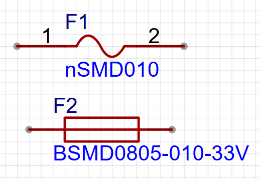

### 1.6 MOSFET

* 在嘉立创eda里面，一般长这样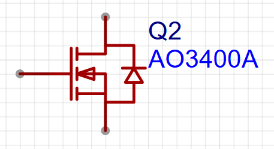

## 2 初步认识嘉立创eda

* 队内一般采用嘉立创eda的专业版（一般来说用网页端就足够了）
* 但是pcb免费下单要采用`嘉立创下单助手`

### 2.1 下单步骤

#### 2.1.1 导出文件

* 一种是直接在嘉立创eda工程里面选择PCB下单，然后打开嘉立创下单助手之后就可以自动生成下单文件

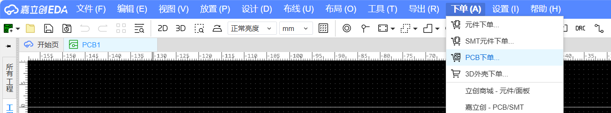

* 一种是导出gerber文件

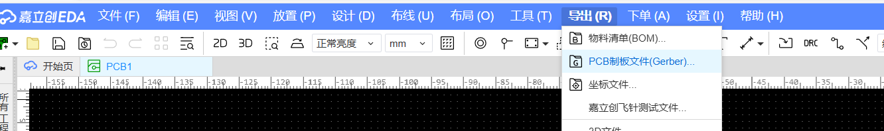

#### 2.1.2 领取优惠卷

* 打开嘉立创下单助手，点击`用户中心`

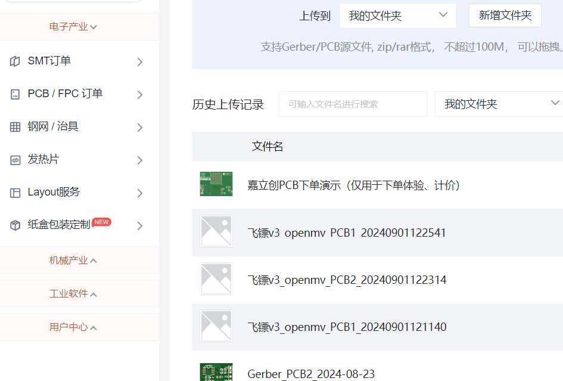

* 再点击`优惠卷中心`，再点击`免费卷领取`

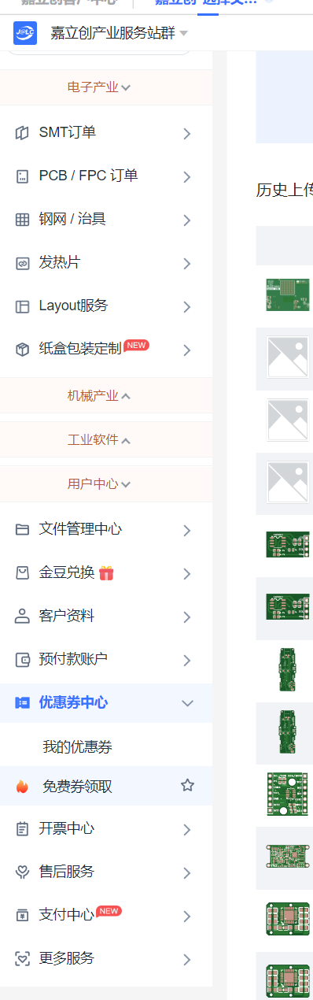

* 再在`PCB+SMT喷锡免费卷·领卷专区`里面，选择1-4层喷锡通用卷

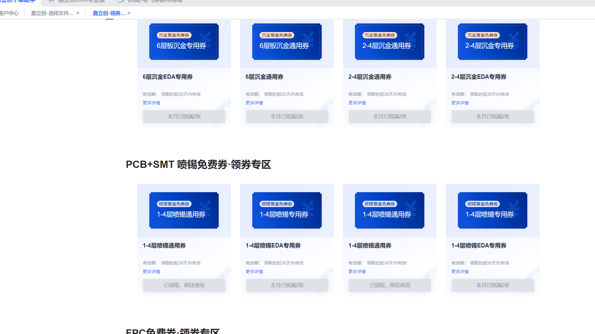

#### 2.1.3 PCB下单

* 点击`PCB/FPC下单`

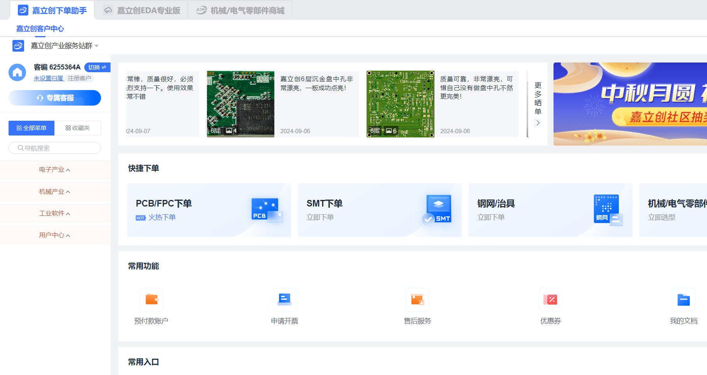

* 有两种，一种是你在嘉立创eda工程里面选择pcb下单后，下面自动生成的工程下单，点击立即下单就好了，还有一个是导出gerber文件，然后点击上面的上传PCB/FPC下单

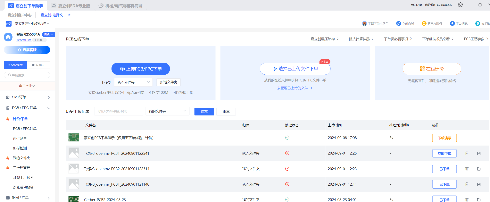

### 2.2 PCB 设计

关注b站立创eda，里面有专业版手把手教学。等到培训课的时候，学长/学姐也会手把手带着画第一块pcb（属于你自己的rm小周边）

