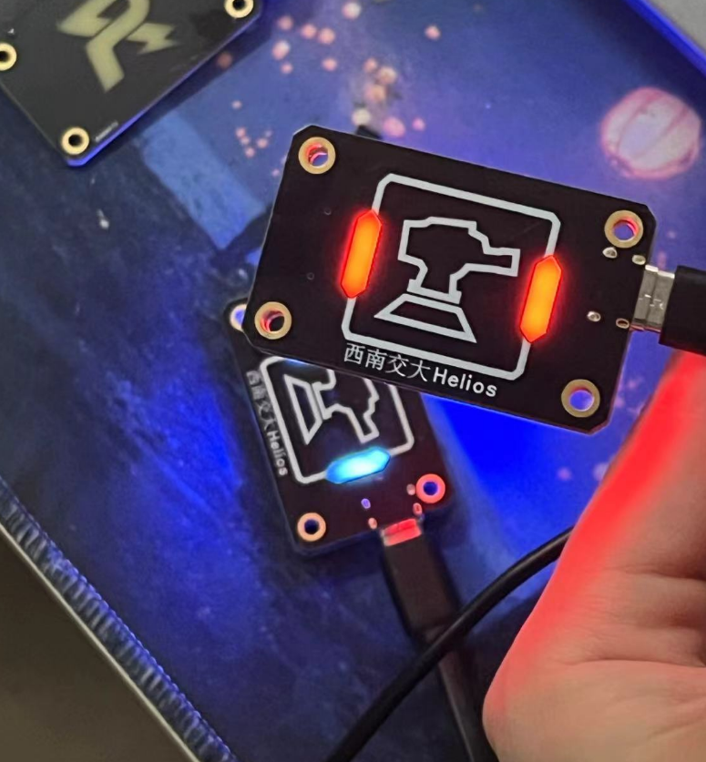
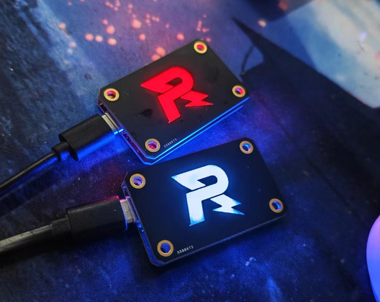
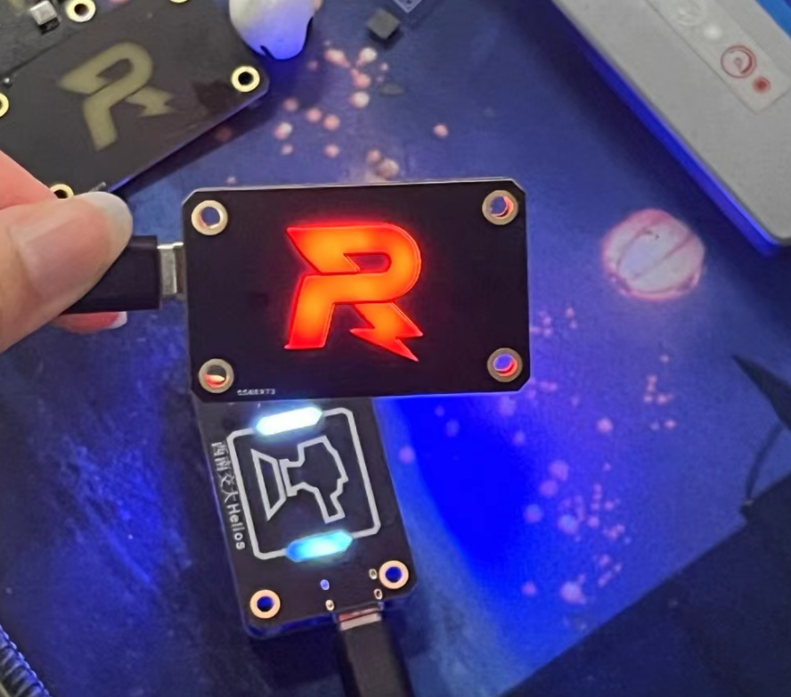
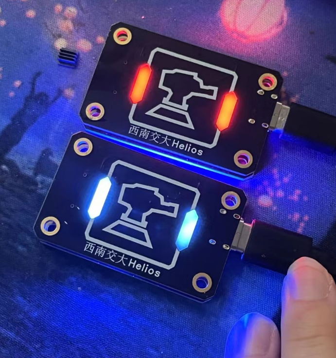

# R标哨兵小周边

有问题可以RM硬件群里问我，也可以私聊找我

QQ：3514205831

## v1.0版本

这版单纯为了硬件组培训时用的，但是所采用的dcdc芯片（优信购买的），有的好有的坏，让人比较恼火。同时害怕新生误操作锂电池，发生事故，所以这版并没有采用锂电池供电，只是单纯的typec供电。同时这版本使用的板对板连接器高度高了1mm，PIN数也过多。

## v1.1 版本

加上了锂电池以及锂电池充电电路，同时可以开关切换灯光颜色，采用了合适高度、合适pin数的板对板连接器。

不过刚刚修改完，还没实物图片