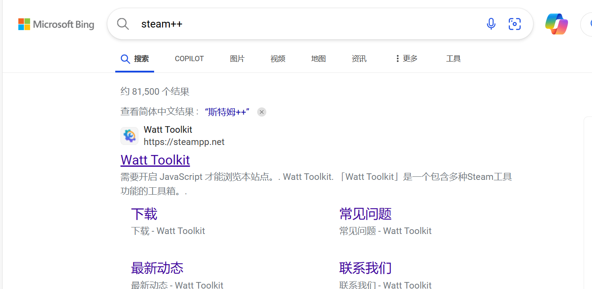
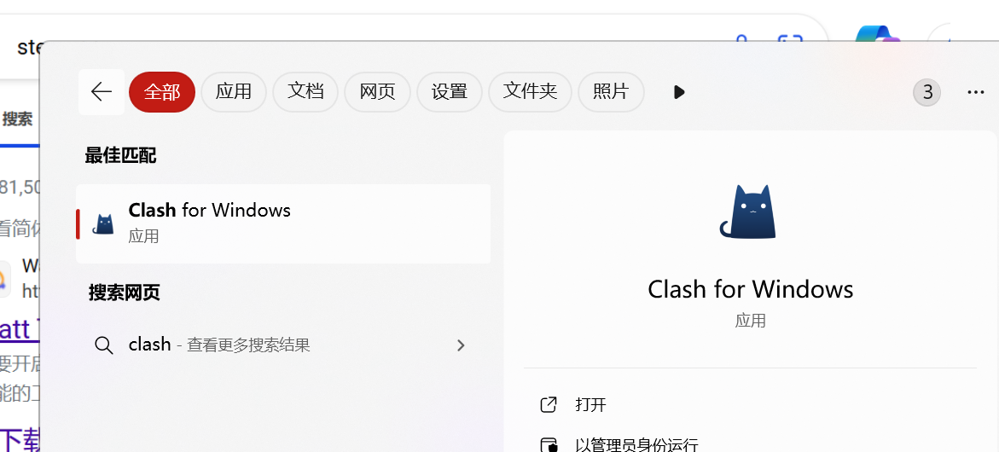
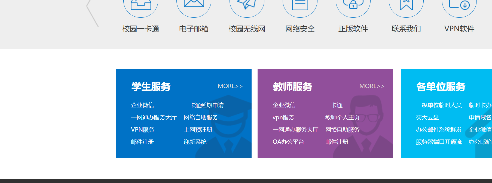
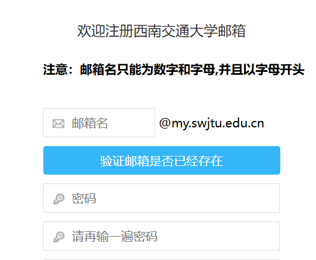

# 前置知识

### 1. 不会登入github的

如果不会搞梯子，上不了github的可以下载steam++

具体下载网址：[瓦特工具箱(Steam++官网) - Watt Toolkit](https://steampp.net/)

还有一个就是用clash，具体教程自己搜（因为我也不记得我当时怎么搞得了）

### 2. 硬件常用网站

1. [Power Designer](https://webench.ti.com/power-designer/)
2. [模拟 | 嵌入式处理 | 半导体公司 | 德州仪器 TI.com.cn](https://www.ti.com.cn/)
3. [半导小芯-芯片查询工具_芯片替代查询_数据手册查询_规格书查询_datasheet查询_IC查询](https://www.semiee.com/)
4. [RoboMaster 社区](https://bbs.robomaster.com/)
5. [ChatGPT](https://chatgpt.com/)
6. [智谱清言](https://chatglm.cn/main/alltoolsdetail?lang=zh)
7. [Thingiverse - Digital Designs for Physical Objects](https://www.thingiverse.com/)
8. [半导小芯-芯片查询工具_芯片替代查询_数据手册查询_规格书查询_datasheet查询_IC查询](https://www.semiee.com/)
9. [立创开源硬件平台](https://oshwhub.com/)
10. [立创商城_一站式电子元器件采购自营商城_嘉立创电子商城](https://www.szlcsc.com/)
11. [MATLAB](https://www.mathworks.com/products/matlab.html)

### 3. 下载matlab正版

登入西南交通大学信网处

[信息化与网络管理处](https://inc.swjtu.edu.cn/)

最底下这里有邮件注册，注册一个你自己的交大邮箱，

然后注册好之后，去matlab官网下载你想要版本的matlab，matlab账户注册的时候就拿你注册的这个交大邮箱去注册，因为交大已经购买了正版的版权了。