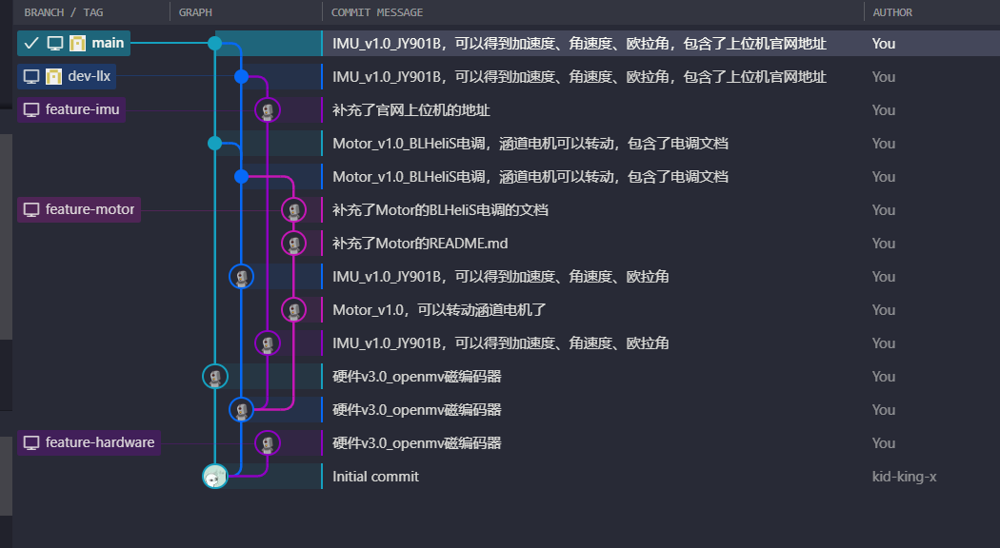
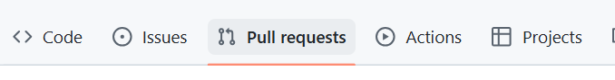
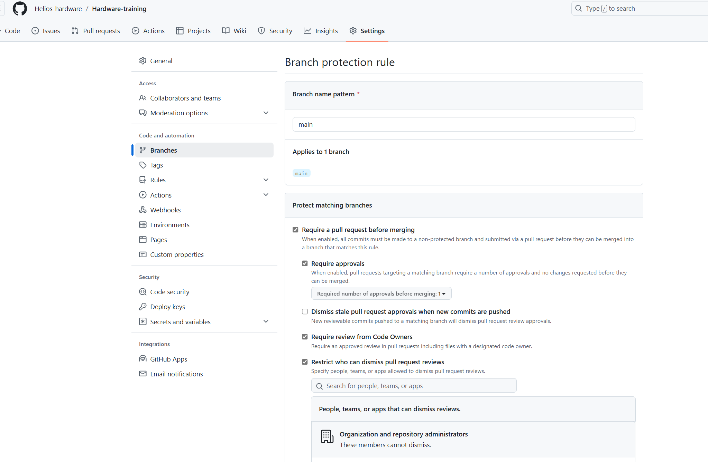
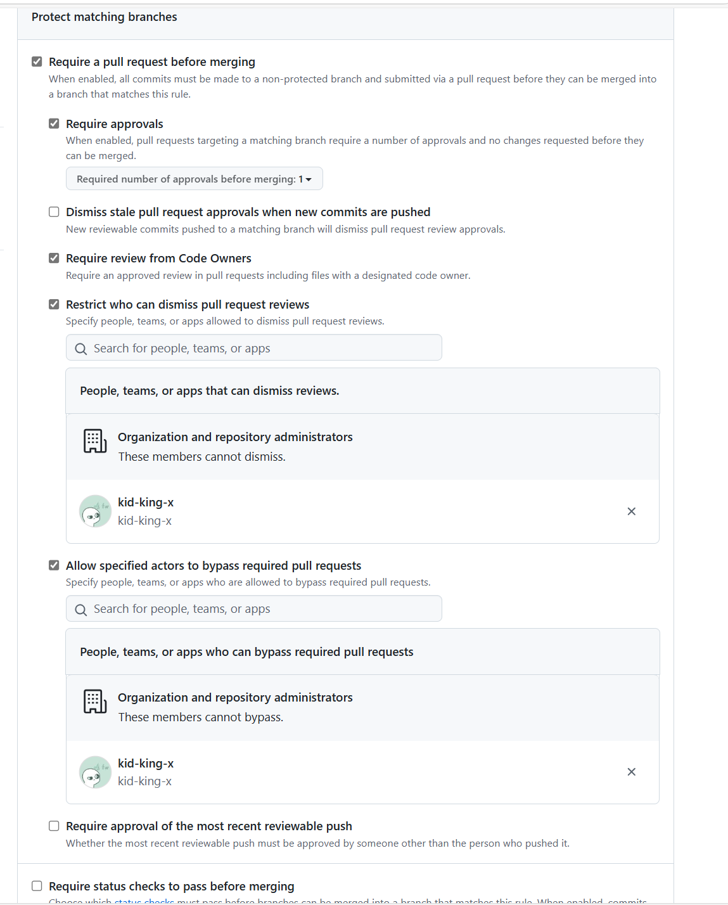
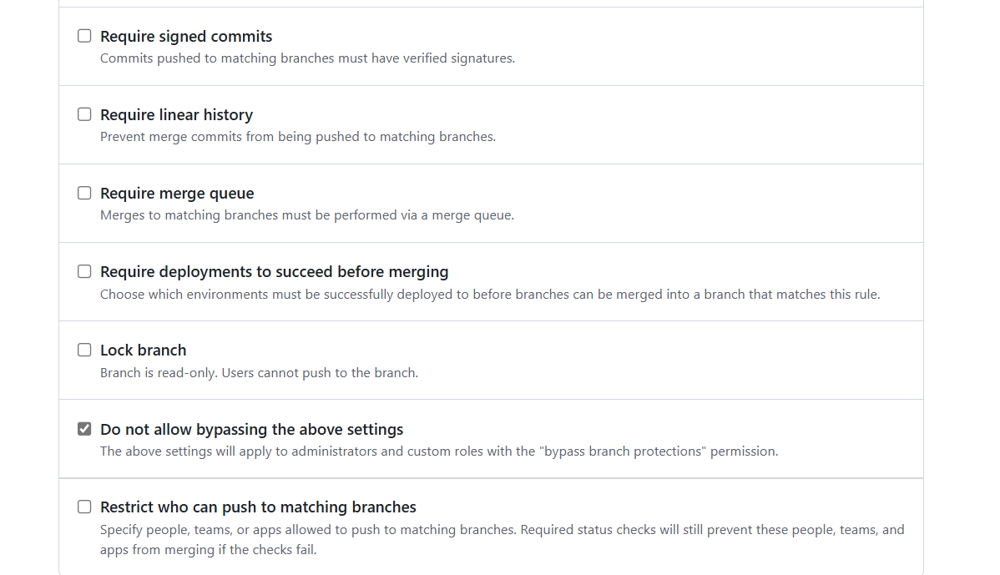

# 硬件git管理规范

## 1 采用模型

硬件组采用的是`githubflow`模型，不过更加简化

## 2 分支管理

主要的`main`分支不变，然后多出来的是`dev-<姓名简拼>`，比如我自己就是`dev-llx`，然后，如果是像制导镖那样，有明确的分支，那么在`dev-llx`下一级分支就是`feature-<分支开发命名>`，比如镖体这边可能就是`feature-imu`或者`feature-hardware`。然后只有在`feature`上完成一版可以用的方案后，才会`merge`到`dev`分支上，然后向`main`分支发起合并请求。

==然后能在云端显示的，只有`main`分支和`dev`分支，==

类似于图上这样，main分支是所有人推送的最后一个分支，也是显示在github上的那个分支，然后我个人的完整版分支就是dev-llx，每次我在feature分支做完完整的一版本的修改后，推送到dev分支，再从dev分支上推送到main分支上，注意，得是一整个版本完整的feature功能完成后，再推送到dev分支上，然后再发起合并请求，推送到main分支上。dev分支类似于release分支

## 3 拉取请求 Pull Requests

首先，只有你的dev分支可以从本地端直接推送上去，但是main分支是不能直接推送上去的，需要在github上发起拉取请求，然后经过审批人的审批才可以把你的dev分支merge到main分支，这么做是为了保护main分支。

## 4 分支保护 Branch protection rules

在setting中选择branch

然后是我个人的配置

* Require a pull request before merging

这个是我对main分支的保护，合并到main分支的每次merge都需要经过审批

* Restrict who can dismiss pull request reviews

这个是指定谁可以驳回别人的PR申请，所以我指定了我自己

* Allow specified actors to bypass required pull requests

这个我选择让我自己可以审批我自己的merge（不需要等待别人的审批），这条建议只给仓库的最终管理者

* Do not allow bypassing the above settings

勾选上这个选项，仓库的管理者就不能跳过审批，但上一条被勾选的人可以跳过
