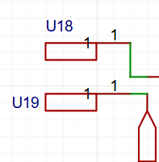
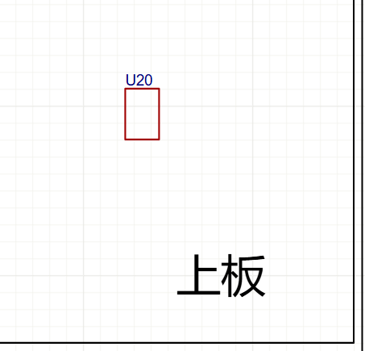
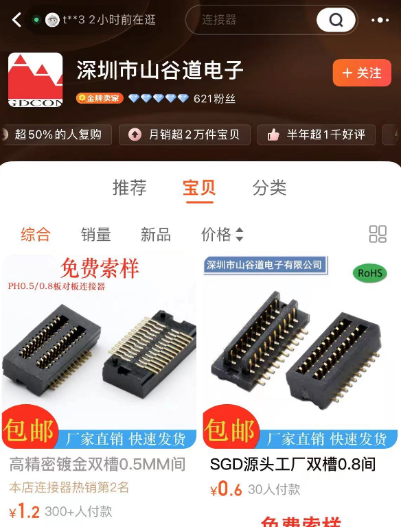
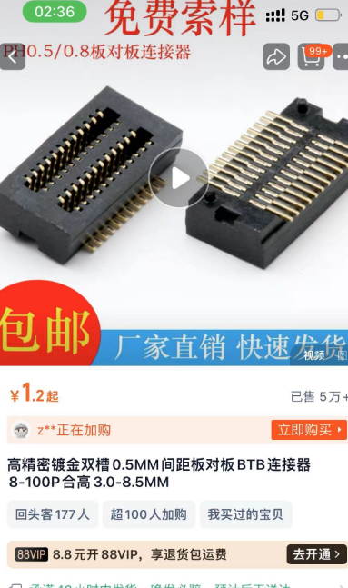
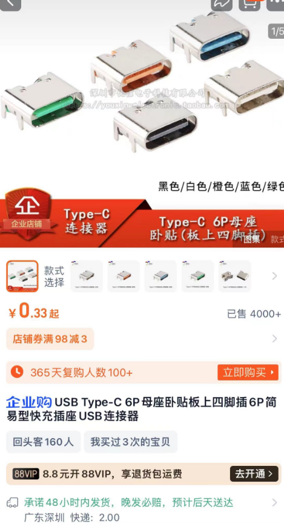
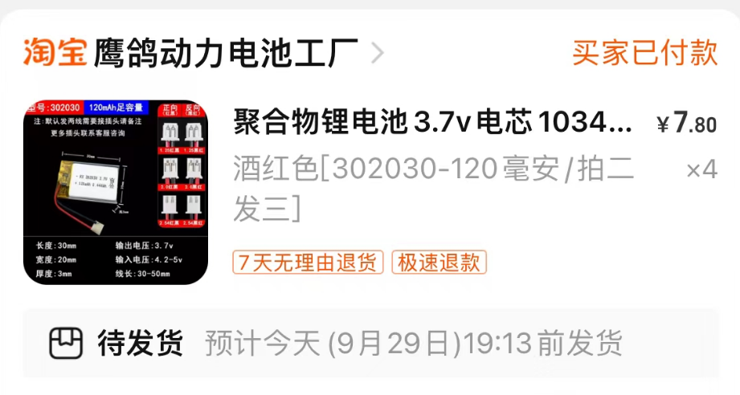

# R标哨兵小周边 v1.1

* 自己绘制的封装

这两个都是自己绘制的封装，都不需要理会，左边那个就是个2*4mm的焊盘，右边就是为了3D好看绘制的上板PCB封装（3D图的时候，可以看到这两个的相对位置）

* 板对板连接器的购买

是在深圳市山谷道电子这家淘宝店铺购买的，然后，选择0.5mm间距，分类里面选择2*5P(10pin)，合高选择3.0mm

* Typec的购买

用的是6引脚的typec，因为不需要通信，当然我特地说这个的购买，是因为我发现优信家有五颜六色的typec，很符合我个人的爱好

* 锂电池的购买

我挑的是这家的这款，尺寸比较合适

### 放在最后的碎碎念

这块PCB的走线绘制有点抽象（为了能同时发捷配和嘉立创发双层板的黑色），硬件群的各位，==轻喷==。

哦对了，不希望被拿去商用我这个！