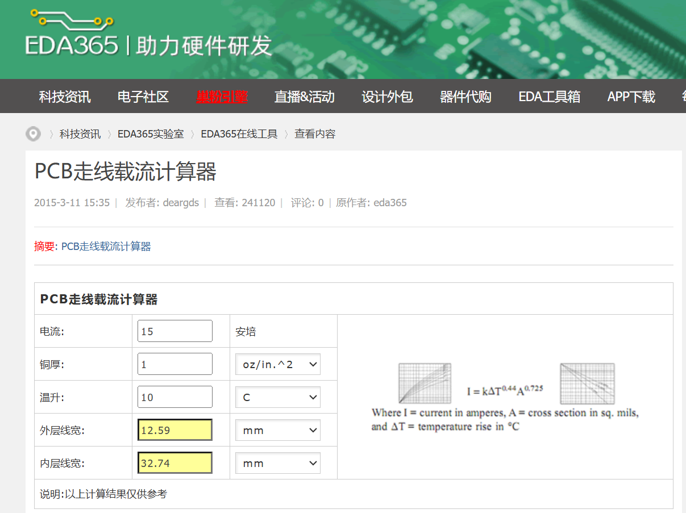
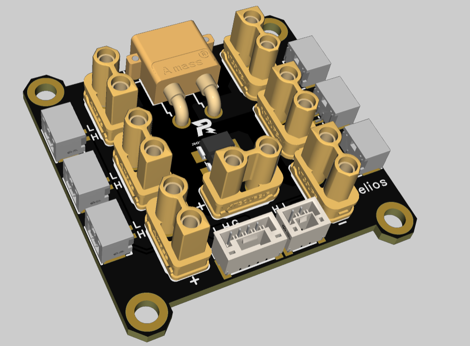
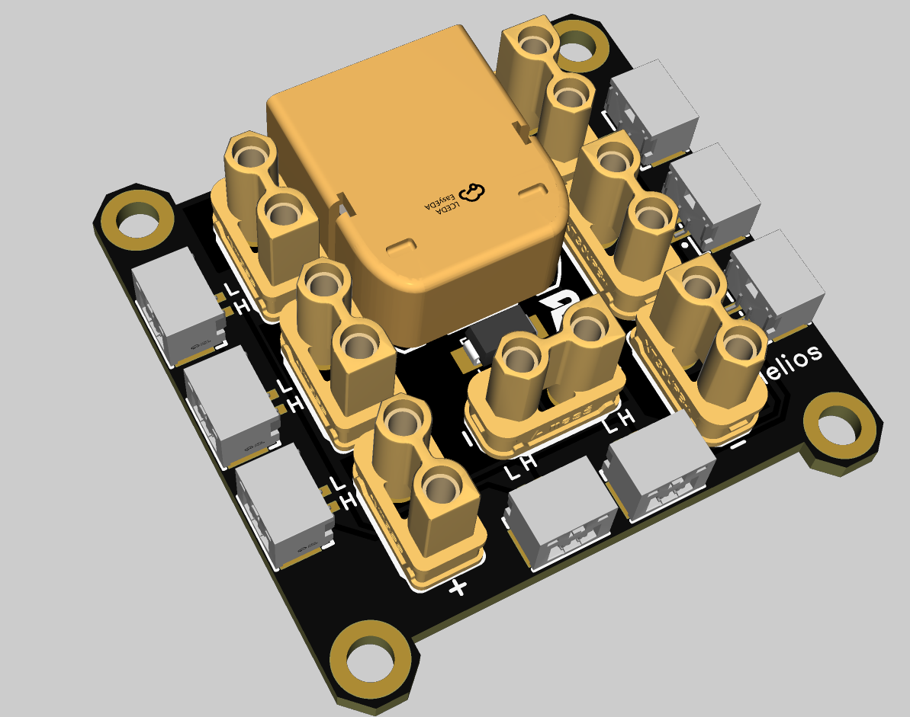
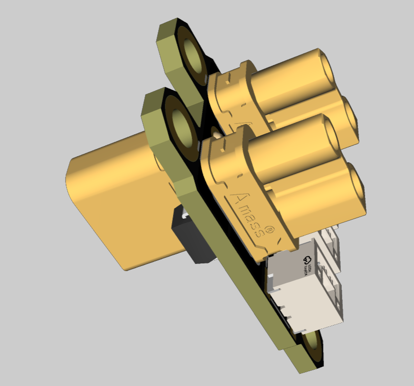
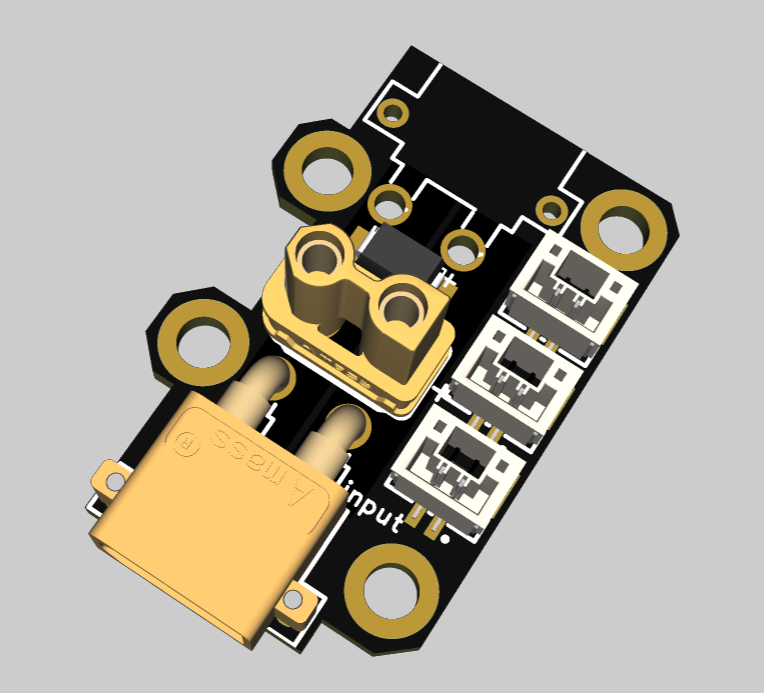
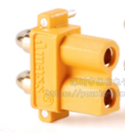
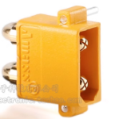

# 分电板设计

个人认为，电控本身是需要学习分电板怎么绘制的，这并没有什么难度，同时可以避免24赛季的惨状——硬件绘制多版分电板，但并不符合哨兵本身走线需求。（不过这只是个人浅薄的认为）

不过设计了各车组都通用的分电板，（适用于对分电板形状朝向没有要求的地方，以及需要一分二的时候）

* 不采用阻焊层走线的原因：一个是用不到阻焊层，上下层的设计已经足够走车的电流，还有一个就是，阻焊层还需要埋入铜线，比较麻烦（且对于不熟悉这个操作的比较容易出问题）

* 焊接gh头：==推荐把锡膏挤好，元件放在pcb上后，丢加热台==（不是很推荐拿电烙铁焊接gh座，操作不当，插拔时候容易使gh座子脱落）

* 分电板3D文件也已经导出（和工程、gerber同名）

* 修复了之前孔位略窄，孔间距离非整数问题

* 如果因为不看说明文档，而导致出问题，硬件不负责解决（除非你遇上了一个热心硬件）。

* PCB走线载流计算器[https://eda365.com/article-12-1.html](https://eda365.com/article-12-1.html)

  

### 1. 大疆分电板（xt30 gh1.25 立式卧式）

这款就是模仿大疆分电板绘制的，焊接时候要==注意中间的两颗gh用的是立式==（立式和卧式信号线是相反的）

### 2. 大疆分电板（xt60 gh1.25）

这版的gh座子全是卧式（或者可以全是立式）

### 3. 一分二

设计一分二的原因是哨兵，以及备赛时候需要焊接一分二的线，对比于焊接一分二的线，还是焊接一分二的板子难度低些

#### 3.1 一分二立式

这个我个人觉得特别适合需要一分二线的时候，小巧好用

#### 3.2 一分二都在同一面

==这个一定要注意：输入的是xt30公头，输出是xt30母头==，pcb上有标注input，一定不能焊接错。因为xt30卧式公母的正负极是相反的，虽然这个板子已经是有了防止焊错的设计，但不防呆逼（==禁止因为卧式xt30插不进去而把小引脚剪掉==）。如果实在拿不准，请咨询硬件组成员。

这个是xt30卧式母头：

这个是xt30卧式公头：