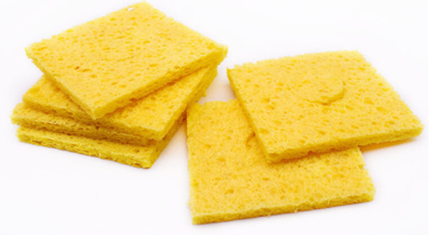

# 焊接工具、焊接技巧

## 1 焊接工具

### 1.1 电烙铁（必备）

* 利用内部发热芯的发热，熔化焊锡

* 作用：焊接所有元器件；拆除直插元器件，不适合拆除芯片

#### 1.1.1 带焊台的电烙铁

* 焊台通常包括电烙铁和一个控制器，提供稳定的温度控制和其他功能。

##### 1.1.1.1 发热芯烙铁头分体式

* 代表型号：白光936（不用刻意追求原厂）
* 优点：可以调温并恒温；有多种烙铁头可以更换；能满足绝大多数场合的焊接需求
* 缺点：体积较大，不便携带；旋钮式恒温精度较偏低；
* 用途：可以很好的焊接直插元件与贴片元件，以及芯片，==不可以用来切割塑料==

##### 1.1.1.1.2 发热芯烙铁头一体式

* 代表型号：白光T12（不用刻意追求原厂）
* 优点：升温速度极快，几乎开机后不用等候就能使用；功率调节速度快，焊接大面积金属也很容 易；数字控温，恒温精度高；能满足绝大多数场合的焊接需求
* 缺点：比较贵
* 用途：可以很好的焊接直插元件与贴片元件，以及芯片，==不可以用来切割塑料==

#### 1.1.2 便携移动电烙铁

* 优点：携带方便，只要搭配个相对应功率的typec充电器（功率不匹配的时候，==注意电压大小要匹配==，具体原因见 `实验室安全` ）

* 缺点：比较贵，除了烙铁本身价格高，还需要一个充电器。

假如便携移动电烙铁的功率要求是65w，但是你手边只有一个20w的充电器（电压匹配的情况下），烙铁升温时间要比在65w正常工作情况下长很多，所以不建议

#### 1.1.3 烙铁头

##### 1.1.3.1 刀头

* 特点：传热能力较好，适合焊接各种形状的元器件以及芯片

##### 1.1.3.2 马蹄头

* 特点：传热面积大，适合焊接大面积金属，不适合焊接贴片元件与贴片芯片

##### 1.1.3.3 一字扁头

* 特点：更适合焊接贴片元件，不适合焊接贴片芯片

##### 1.1.3.4 尖头

* 特点：可用于广泛的焊接场景，但都不太好用；可用于精细焊接；烙铁头容易烧坏

### 1.2 热风枪

* 通过发热丝对吹出来的风加热，使其达到一定温度，从而熔化被吹到部分的焊锡
* 作用：焊接贴片元件，但容易把元件吹跑，不适用于焊接密脚贴片芯片；适用于拆除各类元件，但 容易把元件烤坏；适合吹热缩管、蛇皮管

### 1.3 PTC发热板/加热台

#### 1.3.1 PTC发热板

* 自身恒温发热，通过传导方式使电路板上的焊锡熔化
* 作用：适用于小面积单面焊接或拆除贴片元件，大部分情况较热风枪好用

#### 1.3.2 加热台

* 对比于PTC发热板，均匀发热，调温精准
* 缺点：价格高

### 1.4 尖头镊子（必备）

* 作用：固定或夹取元件
* 不要把尖头镊子拿去处理难清洗、容易弄折尖头的东西（或者==别拿别人的镊子处理==）

### 1.5 台钳

* 作用：固定被焊接电路板

### 1.6 硅胶隔热垫

* 作用：硅胶可耐高温，用于覆盖焊接的桌面，避免烫坏桌面

### 1.7 吸烟风扇

* 作用：吸走焊接时产生的烟尘，避免浓烟扑脸，减小对身体的伤害

### 1.8 回流焊机

* 规范的焊接仪器，实验室前面有一台
* 作用：焊接贴片元件，不适用于焊接密脚贴片芯片，大体积元件难以焊接

## 2 焊接耗材

### 2.1 焊锡丝（必备）

* 由锡合金和助焊剂两部分组成，助焊剂灌注到锡合金中间部位
* 作用：增强电烙铁与被焊接部分的热传导；作为焊接材料

#### 2.1.1 有铅焊锡丝

* 金属成分：63%锡，其余为铅
* 特点：焊点光亮；熔点适中，约为183°C，电烙铁温度大约为300°C；流动性好；但铅有较大的慢 性毒型

#### 2.1.2 无铅焊锡丝

* 金属成分：99%锡，0.7%铜，有的还含有0.3%银
* 特点：熔点较高，约为227°C，电烙铁温度大约为350°C，较大焊点熔化比较费劲；融化后流动性 好；对铜的腐蚀性较强；金属材料无毒

#### 2.1.3 低温无铅焊锡丝

* 金属成分：42%锡，其余为铋

* 特点：熔点很低，约为138°C；凝固后相当脆，大点的元件焊好后一摔就掉；如果不是元件特别不 耐热不建议使用

### 2.2 助焊剂

* 一种气化点在焊锡熔化温度附近，并且能增强焊锡流动性的材料
* 作用：在焊接工艺中能帮助和促进焊接过程，同时具有保护作用、阻止氧化反应

#### 2.2.1 松香

* 特点：最常见的助焊剂；效果不错，但容易碳化，使用过多会产生大量积碳难以清理

#### 2.2.2 BGA助焊膏

* 特点：特别好用，非常好用

#### 2.2.3 铁罐膏状助焊剂

* 特点：效果一般，挥发太快难以起到真正效果，有腐蚀性，残渣多，不建议使用

#### 2.2.4 塑料盒助焊膏

* 特点：效果一般，挥发较快，烟很大

#### 2.2.5 不锈钢助焊剂

* 特点：能高效够去除氧化层，用于已经氧化的铜线或者不锈钢等材料焊接，但腐蚀性较强，不宜多 用

### 2.3 焊锡膏

* 一种磨碎的焊锡和膏状助焊剂的混合物
* 作用：用于和加热板或热风枪配合使用焊接贴片元件

焊锡膏里面分类和焊锡丝类似，个人比较推荐安立信家的中温有铅焊锡膏

### 2.4 吸锡线

* 一截多股铜线，锡熔化后可被吸到铜线的缝隙中去
* 作用：去除多余焊锡

### 2.5 烙铁清洁海绵

* 一块能吸水的耐高温海绵
* 作用：==湿水==后，可将电烙铁在其上擦拭，去除焊锡渣和烙铁头上其他不想要的东西（==不要在干的海绵上擦拭==）

### 2.6 洗板水

* 一种很强的有机溶剂
* 作用：溶解焊接过程残留在电路板上的助焊剂和积碳等杂质

### 2.7 烙铁头复活膏

* 作用：使已经完全氧化不粘锡的烙铁恢复沾锡能力，使用前可能需要刮除烙铁头上的积碳

### 2.8 高温胶带

* 作用：使用热风枪时，保护不想焊接的部分的焊锡不熔化

### 2.9 N95口罩

* 作用：过滤焊接产生的烟尘，减小对身体造成的伤害

## 3 焊接技巧（见“教你焊接的漫画.pdf”）

