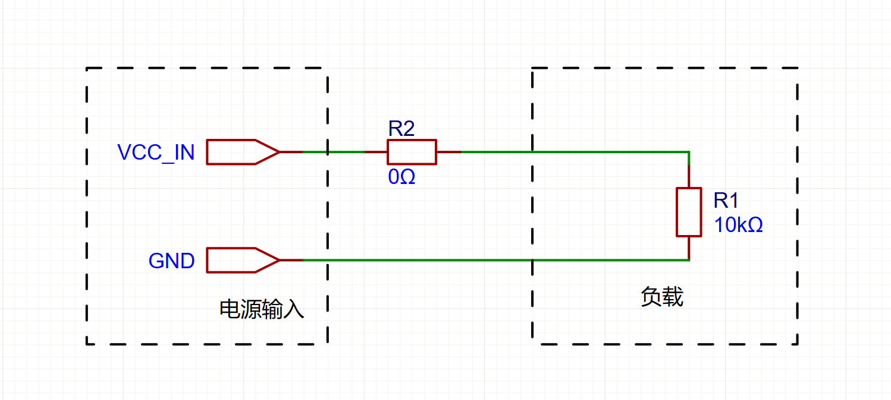
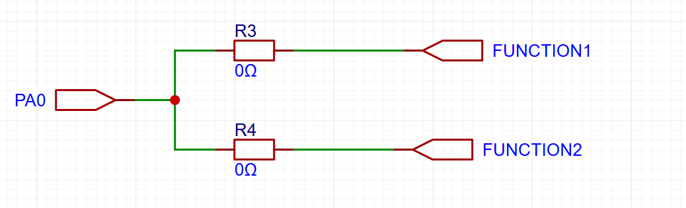
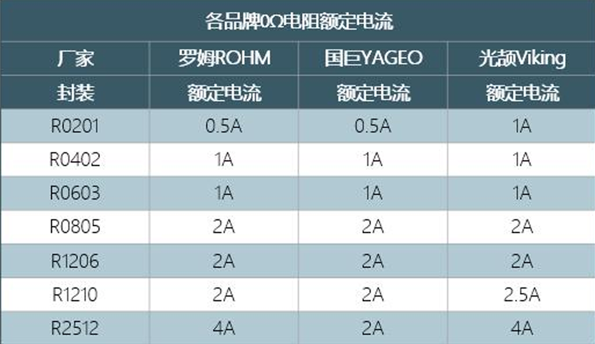
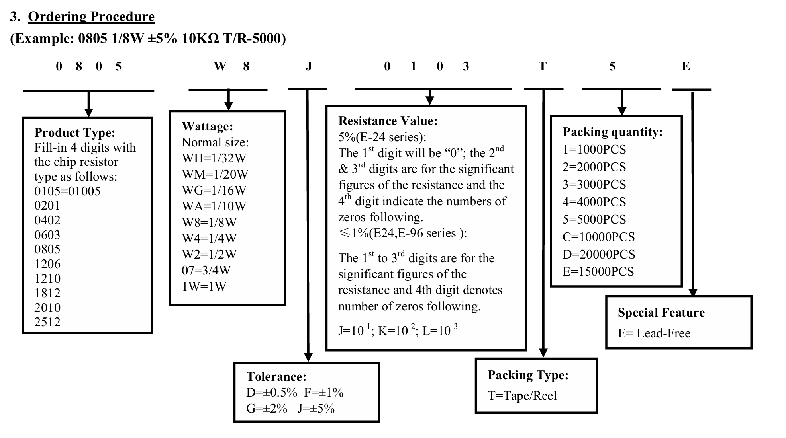
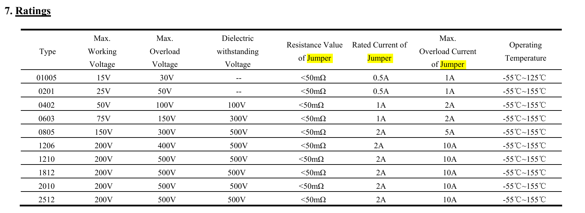
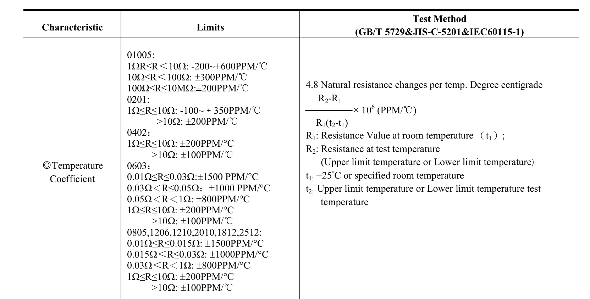
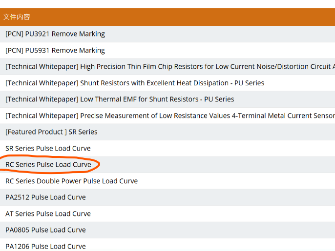
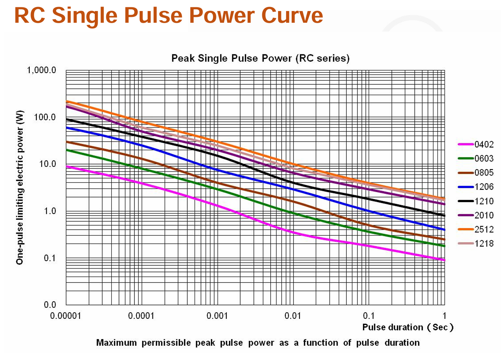
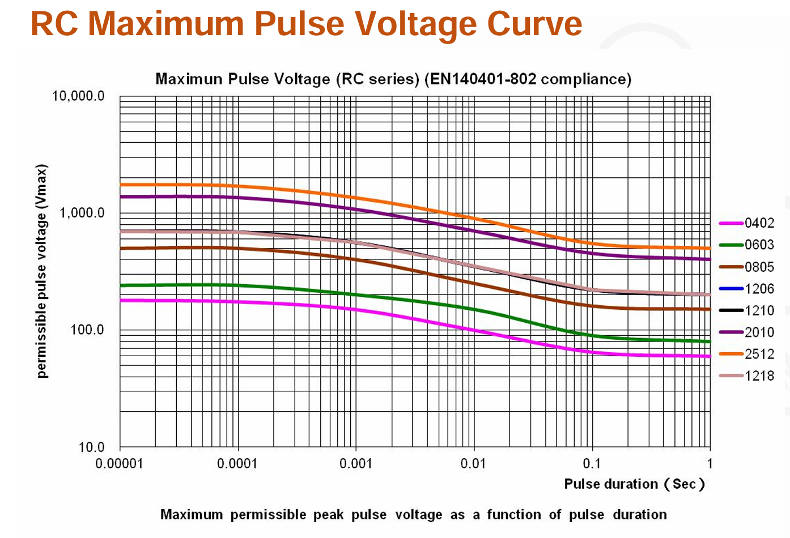

# 电阻篇

## 一. 0欧电阻

0欧电阻的阻值并不是真的0欧，实际最大阻值10mΩ，20mΩ，50mΩ可选。

#### 1. 0欧电阻的作用

* **增加测试点，测试电流**

·	类似于下图这样的电路，如果我想要测试流过负载的电流大小，可以在电源输入与负载之间加入一个0欧的电阻，由于0欧电阻的阻值很小，相对于负载可以忽略不计，所以在测试流过负载电流大小的时候，可以拆掉0欧电阻，然后用万用表电流档串联进电路，就可以测试电流大小了。

* **预留，先占个位置，等测试之后再确定0欧电阻这里的电阻值应该放多大好**

* **用做跳线，兼容设计**

某些时候设计的板件在测试时候可能需要切换功能，但是你又不想能被用户随意拔插跳线帽（你永远不知道使用你板子的人会怎么操作），就会采用0欧电阻当作跳线帽使用

* 至于还有的把0欧电阻用作布线时跨接电路，我个人来说，一般不是很推荐，因为现在都是多层板了，没必要牺牲表面空间。还有用作模拟地、数字地的连接，单点接地，一般来说，我个人更推荐磁珠。还有的用作电路保护充当保险丝的，emmm，为了我的小命考虑，我不推荐helios的硬件组在我还在helios期间使用0欧电阻用作保险丝。

#### 2. 0欧电阻要注意的点

* **0欧电阻的过流能力**

0欧电阻不是有个测试电流的功能吗，那么我们就得知道这个0欧电阻能过多大电流，当然不同厂商对于0欧电阻的过流参数都不一样，建议看厂商手册（或者在计算时候用每个厂商里面数值最小的来计算）

不过还有一个观点就是0欧电阻的过流能力是计算出来的，比如下面这组参数，假如0欧电阻的阻值是20mΩ，然后1/8w，过电流量就是2.5A，如果0欧电阻的阻值是50mΩ，那么过电流量就是1.58A，可以看出来和上面的表格给出的不一样，我个人是建议按小的算，给元器件留点余量，以免出现过流、过压的问题。

然后，还可以看到，有的封装明明变大了，但是为什么额定电流并没有变大，这个是因为额定电流没变，但是瞬时电流变大了，可以自行打开电阻的手册看看。注意其中的 ==Jumper==就是指0Ω电阻

还有个问题就是，假如我需要0欧电阻能过3A电流怎么办呢，并联两颗0欧电阻就行了。

## 二、电阻的温度系数TCR

一般来说，我们在设计电路的时候，很少会去考虑温度系数这么个参数，但还是得提一下，以免出现问题的时候不知道从哪里找问题。

*电阻是有温漂的*。

电阻温度系数（temperature coefficient of resistance 简称 TCR）表示电阻当温度改变1摄氏度时，电阻值的相对变化

可以在手册里面找到关于TCR的描述，并且手册中也附上了TCR的描述、计算

一般来说，厚膜电阻的温度系数会高于薄膜电阻

## 三、瞬时功率问题

在一些开关电路，在开关的时候，因为寄生电容或是电感的存在，可能会对电阻有一个瞬间的冲击，这一瞬间电阻功率会很大，那么就得发考虑电阻能否承受了，可以在下面的链接中找到文档。

[技术文件 – YAGEO全球被动元件领导厂商](https://www.yageo.com/zh-CN/Download/Index/technical_documents/r_chip?target=target_title)

可以看到一张是瞬时电流，一张是瞬时电压。

比如0805的能承受1w左右的0.1s的冲激。