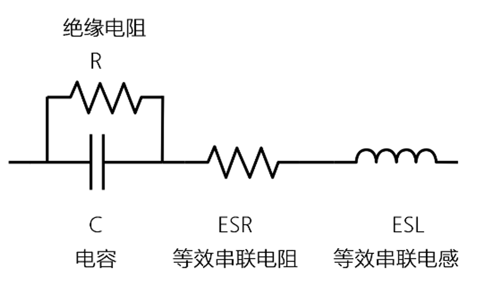

# 电容篇

## 1 MLCC陶瓷电容

### 1.1 购买电容注意事项

选择电容时，要注意是否有“科技”，比如你可以在淘宝看到0603封装，10uf，50V耐压，这个大概率是有问题的，购买来的电容可能是容量小于10uf，也可能是耐压值小于50V。比较合理的可能是1206封装，10uf，25V耐压这样

为了避免这种情况，要么购买电容的时候，注意下这个封装的电容可不可能有这个参数（比如0805封装，10uF，10V这样会是比较合理的），要么去立创商城上购买，这种的可信度高点

### 1.2 电容电路实际模型

​	实际生产的电容都不是理想的，会有寄生电感，等效串联电阻存在，同时 因为电容两极板间的介质不是绝对绝缘的，因此存在数值较大的绝缘电阻。

