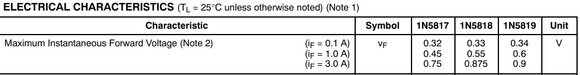
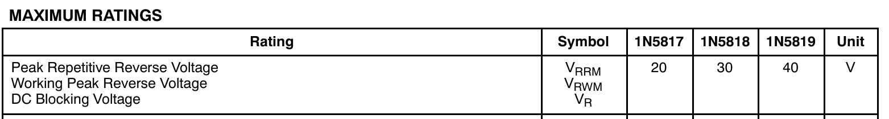

# 二极管

* 入门视频：[超形象鬼畜动画一看就懂，二极管工作原理_哔哩哔哩_bilibili](https://www.bilibili.com/video/BV1Qr4y1H7i8?spm_id_from=333.788.recommend_more_video.1&vd_source=5fc6351cf113dfef6abb9b02ed12c9b7)
* 比较重要的参数：耐压，反向恢复时间，工作频率，压降

### 1. 肖特基二极管和硅二极管对比

* 肖特基二极管的耐压一般远低于硅二极管
* 肖特基二极管的导通电压也低于硅二极管
* 肖特基二极管的速度高于硅二极管（反向恢复速度）

一般会在需要速度和压降的地方用到肖特基二极管。

### 2. 二极管导通电压

这里我打开我个人比较常用的一个型号的数据手册

可以看到通过0.1A电流的时候。1N5819压降才为==0.34V==，和模电说的经典0.7V是不一样的。

还有一个是发光二极管的导通电压，以RoboMaster比赛里面最常见的红蓝led作为对比：

红色led的导通电压约为2V，蓝色led的导通电压约为2.8V，所以如果想要红蓝led的亮度一致的话，电压相同的情况下，串联电阻值就要不一样。

### 3. 耐压

* **Peak Repetitive Reverse Voltage (V~RRM~) **    峰值重复反向电压

​	这是二极管或整流器在正常工作条件下，可以承受的最大反向电压。这是==周期性==施加的反向电压（如在交流电源中）中不会导致器件损坏的最大峰值。

* **Working Peak Reverse Voltage (V~RWM~)**     工作峰值反向电压

​	这是指在二极管或整流器工作期间施加的最大反向电压。在==连续使用的电路==中，它是不会损坏器件的工作条件下的最大反向电压。

* **DC Blocking Voltage (V~R~)**         直流阻断电压

​	这是指二极管在施加==直流反向电压==时，能够阻断电流的最大电压。它是二极管用于阻止直流电流通过时可以承受的最大电压。

不过可以看出的是，在1N5819里面，这三个的数值并没有什么变化。

