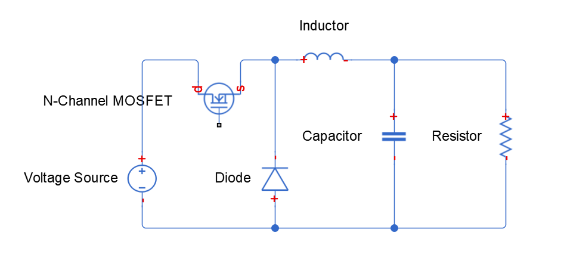

# buck电路

可以先看下这个视频，来对buck电路有个初步的认识

[直流电12V变5V 开关电源的工作原理 DC DC降压稳压电路的基本原理_哔哩哔哩_bilibili](https://www.bilibili.com/video/BV1644y1q74w/?spm_id_from=333.788.recommend_more_video.0&vd_source=5fc6351cf113dfef6abb9b02ed12c9b7)

## 1 经典buck电路

虽然真实仿真的时候用的不是这组数据，
